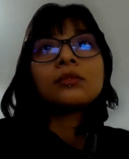

# **Capítulo I: Introducción**
## **1.1. Startup Profile**
### **1.1.1. Descripción de la Startup**

En Perú, el transporte escolar es un sector que, a pesar de su gran importancia para las familias, aún opera de manera manual y carece de sistemas tecnológicos que permitan un seguimiento en tiempo real. Esto provoca que muchos padres sientan una incertidumbre diaria, ya que desean un control más cercano y la certeza de saber si sus hijos abordaron el vehículo o llegaron a su destino con seguridad.

En respuesta a esta realidad, **Creatividad** surge como una startup tecnológica enfocada en revolucionar la seguridad y tranquilidad en el entorno del transporte escolar. Nuestro modelo de negocio propone reemplazar los procesos manuales con herramientas digitales a través de **Children Path**. Children Path reúne a todos los actores involucrados en el transporte escolar en una única plataforma, ofreciendo trazabilidad en tiempo real y brindando a las familias una mayor tranquilidad durante los desplazamientos diarios.

**Misión**

Facilitar la logística y el monitoreo del transporte escolar mediante un entorno digital seguro, en tiempo real e intuitivo, que priorice la tranquilidad de las familias y la eficiencia de los conductores.

**Visión**

Convertirnos en la plataforma líder y referente de seguridad en el transporte escolar, reconocida por ofrecer total transparencia en el transporte de estudiantes en tiempo real.

**Objetivos de la Startup**

- Optimizar la gestión del transporte escolar a través de herramientas digitales que reemplacen los procesos manuales.
- Diseñar una aplicación intuitiva y accesible que facilite la interacción entre padres y conductores.
- Promover la adopción tecnológica en el sector del transporte escolar, fomentando soluciones modernas y eficientes.
- Establecer alianzas estratégicas con instituciones educativas y servicios de transporte para ampliar la cobertura del servicio.

**Valores de la Startup**

- **Seguridad:** Es nuestra máxima prioridad; cada funcionalidad está diseñada para proteger la integridad de los estudiantes y la tranquilidad de los padres.
- **Transparencia:** Compartimos información real y visible sobre cada viaje, generando confianza entre padres, conductores e instituciones.
- **Innovación:** Mejoramos constantemente nuestra plataforma mediante el uso de tecnologías modernas que potencien la experiencia de usuarios y conductores.

### **1.1.2. Perfiles de integrantes del equipo**

<table width="100%">
  <tbody>
      <tr>
      <td width="30%" align="center" valign="middle">
        
         
        <i></i>
      </td>
      <td width="70%" valign="top" style="padding-left: 20px;">
        <h3>Luis Alonso Huaco Oliva</h3>
        
<b>Codigo de Estudiante: u202417743</b> 

        
<b>Age: 24</b> 

        
<b>Especialidad: Ingeniería de Software</b> 

         

<b>Sobre mí:</b>

Me apasiona aprender y disfruto adquirir nuevos conocimientos. Tengo conocimientos de HTML y lógica de programación, y actualmente curso las asignaturas de Aplicaciones Web. Me considero una persona que busca aprender las cosas de manera adecuada para poder aplicarlas en diferentes contextos y evitar limitar el conocimiento a un solo tema.

    </tr>
          <tr>
      <td width="30%" align="center" valign="middle">
        
         
        <i></i>
      </td>
      <td width="70%" valign="top" style="padding-left: 20px;">
        <h3>Diana Pareja Caceres</h3>
        
<b>Codigo de Estudiante: u202422589</b> 

        
<b>Age: 24</b> 

        
<b>Especialidad: Ingeniería de Software</b> 

         

<b>Sobre mí:</b>

Estudiante de software con alta capacidad de aprendizaje y gusto por la excelencia técnica. Cuento con formación en lógica de programación, HTML y desarrollo de Aplicaciones Web. Me considero una persona meticulosa y orientada al detalle, enfocada en dominar las tecnologías desde su raíz para aplicarlas de forma versátil y con criterio en diversos contextos digitales.

    </tr>
          <tr>
      <td width="30%" align="center" valign="middle">
        
         
        <i></i>
      </td>
      <td width="70%" valign="top" style="padding-left: 20px;">
        <h3>Piero Alejandro Razuri Ucañan</h3>
        
<b>Codigo de Estudiante: U202213484</b> 

        
<b>Age: 24</b> 

        
<b>Especialidad: Ingeniería de Software</b> 

         

<b>Sobre mí:</b>

Me apasiona la tecnología y el reto constante de superar mis propios límites. Aunque aún estoy construyendo mi camino y perfeccionando mis habilidades, cuento con bases en lógica de programación, HTML y actualmente continúo aprendiendo en Aplicaciones Web. Me defino como una persona constante y perseverante, con una enorme disposición para aprender de los errores, buscar soluciones con actitud positiva y dar siempre lo mejor de mí en cada proyecto.

    </tr>
           <tr>
      <td width="30%" align="center" valign="middle">
        
         
        <i></i>
      </td>
      <td width="70%" valign="top" style="padding-left: 20px;">
        <h3>Brandon Wilder Soto Palacios</h3>
        
<b>Codigo de Estudiante: u202315640</b> 

        
<b>Age: 21</b> 

        
<b>Especialidad: Ingeniería de Software</b> 

         

<b>Sobre mí:</b>

Soy estudiante de la carrera de Ingeniería de Software en la Universidad Peruana de Ciencias Aplicadas. Tengo intereses en la tecnología y su constante evolución. Tengo conocimientos de programación en lenguajes como C++, Python, JavaScript, HTML y CSS. Soy un poco reservado, pero con muchas de ganas de aprender nuevas cosas.

    </tr>
      <tr>
      <td width="30%" align="center" valign="middle">
        
         
        <i></i>
      </td>
      <td width="70%" valign="top" style="padding-left: 20px;">
        <h3>Luis Alonso Huaco Oliva</h3>
        
<b>Codigo de Estudiante: u202417743</b> 

        
<b>Age: 24</b> 

        
<b>Especialidad: Ingeniería de Software</b> 

         

<b>Sobre mí:</b>

Me apasiona aprender y disfruto adquirir nuevos conocimientos. Tengo conocimientos de HTML y lógica de programación, y actualmente curso las asignaturas de Aplicaciones Web. Me considero una persona que busca aprender las cosas de manera adecuada para poder aplicarlas en diferentes contextos y evitar limitar el conocimiento a un solo tema.

    </tr>
  </tbody>
</table>

## **1.2. Solution Profile**
### **1.2.1. Antecedentes y problemática**

El transporte escolar en Perú se ha caracterizado históricamente por un alto nivel de informalidad y la ausencia de estándares tecnológicos. Las familias confían el traslado de sus hijos a terceros basándose en recomendaciones de otros padres, pero carecen de una plataforma dedicada que profesionalice el servicio y brinde visibilidad durante los trayectos. Al no existir un sistema de seguimiento en tiempo real, los padres experimentan una incertidumbre constante, sin saber si los estudiantes abordaron el vehículo de manera segura o llegaron a su destino.

En este contexto, el principal problema que buscamos abordar es la falta de formalización digital en el transporte escolar y la ausencia de un canal de comunicación centralizado que garantice la tranquilidad de los padres. Esta deficiencia no solo afecta emocionalmente a las familias, sino que también genera ineficiencias y riesgos para los conductores, quienes se ven obligados a gestionar la comunicación de forma improvisada y manual mientras operan el vehículo.

**Método 5W y 2H**

* **¿Qué?**

  El problema principal es la falta de organización e información durante la ruta del transporte escolar. Actualmente, los padres dependen de comunicarse con los conductores mediante llamadas o mensajes, lo que supone distracciones peligrosas para el conductor y resultan insuficientes para la tranquilidad de los padres. Además, esto no siempre es efectivo y puede generar confusiones cuando el conductor notifica lo que el padre pregunta, posiblemente debido a errores humanos.

* **¿Quién?**

  Los más afectados son los padres, especialmente aquellos con hijos en educación básica, que no tienen certeza sobre el transporte de sus hijos, y los conductores de transporte escolar, que deben realizar varias tareas al mismo tiempo, lo que puede llevar a cometer errores involuntarios.

* **¿Cuándo?**

  Esta situación ocurre a diario en días escolares durante las horas punta, tanto en el recojo matutino entre las 6:20 a.m. y las 7:10 a.m., como en el regreso vespertino entre las 2:00 p.m. y las 4:00 p.m.

* **¿Dónde?**

  Principalmente en distritos de Lima Metropolitana con alta demanda de transporte escolar y tráfico constante.

* **¿Por qué?**

  Porque los servicios de transporte escolar continúan operando de manera tradicional; es decir, aún no se han incorporado suficientemente herramientas digitales que ayuden a organizar rutas o informar a los padres en tiempo real.

* **¿Cómo?**

  El problema se refleja en tiempos de espera innecesarios, congestión en los puntos de recojo y llamadas constantes al conductor preguntando por su ubicación. Para solucionarlo, proponemos **Children Path**, una aplicación que permite a los usuarios visualizar la ubicación del vehículo escolar y recibir notificaciones sobre el estado del viaje.

* **¿Cuánto?**

  Esto genera mayores costos de tiempo y combustible para los conductores, mientras que para los padres supone una preocupación constante y tiempo perdido esperando sin información clara.

### **1.2.2 Lean UX Process**
#### **1.2.2.1. Lean UX Problem Statements**

Los servicios de transporte escolar en Perú, especialmente aquellos gestionados por conductores independientes o pequeñas empresas, aún hacen un uso limitado de la tecnología para controlar y dar seguimiento a las rutas diarias. Esto afecta directamente la tranquilidad de los padres, ya que a menudo no saben con certeza dónde se encuentran sus hijos, y también complica la labor de los conductores.

Actualmente, la comunicación se basa en llamadas o mensajes, y el control de asistencia suele realizarse de forma manual, lo que lo hace propenso a posibles errores. Esto puede generar confusiones, demoras y una mala coordinación cuando ocurre un imprevisto, como cuando un padre olvida notificar que su hijo no asistirá o cuando un estudiante tarda más de lo esperado.

Además, existen factores que dificultan la mejora de este servicio, como el tráfico en ciudades como Lima, donde se pierde gran cantidad de tiempo durante las horas punta, lo que dificulta cumplir con horarios exactos. Otro factor es que el conductor no debería usar el celular mientras conduce, ya que representa un riesgo; sin embargo, actualmente se ven obligados a hacerlo cuando los padres preguntan por sus hijos mediante mensajes o llamadas.

En respuesta a esta situación, proponemos **Children Path**, una solución que busca facilitar el seguimiento del transporte escolar a través de una aplicación fácil de usar. Permitirá a los padres conocer la ubicación del vehículo y recibir notificaciones sobre el viaje, además de registrar digitalmente la asistencia de los estudiantes sin que el conductor tenga que interactuar constantemente con el sistema.

De esta manera, pretendemos mejorar la organización del servicio y brindar mayor tranquilidad tanto a padres como a conductores.

¿Cómo podemos ayudar a los padres y conductores de transporte escolar a tener un mejor control de la ruta, proporcionando información clara y segura sin crear distracciones ni dificultar el uso del sistema?

#### **1.2.2.2. Lean UX Assumptions**

**Resultados de Negocio**
* Establecer a Creatividad como la herramienta tecnológica estándar para el transporte escolar en Lima Metropolitana.
* Aumentar la retención de conductores afiliados demostrando ahorros en tiempo y combustible.
* Generar ingresos recurrentes a través de un modelo SaaS dirigido a empresas de transporte y conductores independientes.
* Promover la formalización y profesionalización del sector de transporte escolar.

**Beneficios para los Usuarios**
* **Padres**

  Eliminar la incertidumbre al conocer la ubicación exacta y el estado del transporte de su hijo en tiempo real.
* **Conductores**

  Ahorrar tiempo en cada parada y reducir el consumo de combustible al evitar esperas innecesarias y disminuir tareas manuales como atender llamadas o mensajes.

**Suposiciones**
* Creemos que los padres tienen una necesidad urgente de visibilidad y control sobre el transporte escolar.
* Estas necesidades pueden resolverse con una plataforma centralizada que automatice las notificaciones de la ruta sin distraer al conductor.
* Nuestros clientes iniciales son conductores independientes y padres de colegios privados que buscan modernizar su servicio.
* Lo que los padres desean de nuestro servicio es tranquilidad, mientras que los conductores esperan eficiencia y reducción de tareas.
* Conseguiremos nuestros primeros clientes a través de alianzas con asociaciones de padres de familia y recomendaciones de boca a boca entre conductores de la misma zona.
* Generaremos ingresos mediante planes de suscripción mensual pagados por conductores independientes o empresas de transporte.
* Nuestros principales competidores actuales son métodos informales como grupos de WhatsApp y algunas plataformas genéricas de rastreo GPS vehicular.
* Nuestro mayor riesgo es la resistencia al cambio por parte de conductores mayores o la pérdida de señal GPS/Internet en ciertas zonas urbanas.

**Conclusiones de las suposiciones**
* **¿Quién es el usuario?**

  Principalmente padres preocupados por la seguridad de sus hijos y conductores de transporte escolar que buscan optimizar su tiempo y ofrecer un mejor servicio.
* **¿Dónde encaja nuestro producto en su trabajo o vida?**

  En días escolares. Para los padres, encaja mientras están en casa o en el trabajo esperando una notificación del conductor sobre su hijo. Para los conductores, encaja dentro de su vehículo durante todo el trayecto, desde que los estudiantes suben hasta que son dejados en sus hogares.
* **¿Qué problemas tiene nuestro producto y cómo pueden resolverse?**

  Un problema grave podría ser la distracción del conductor al usar la aplicación. Esto se resolverá automatizando alertas de proximidad para que el conductor no tenga que tocar la pantalla ni escribir manualmente. Otro problema es la dependencia de datos móviles; se resolverá optimizando la aplicación para que consuma el mínimo ancho de banda y admita funcionamiento básico en segundo plano.
* **¿Cuándo y cómo se usa nuestro producto?**

  Se usa intensivamente durante las ventanas de transporte escolar, tanto por la mañana como por la tarde. El conductor lo usa activamente en un soporte para teléfono en el tablero del auto, mientras que los padres lo usan a través de notificaciones en sus dispositivos móviles.
* **¿Qué características son importantes?**

  Alta precisión del GPS, notificaciones rápidas y automáticas, bajo consumo de batería en el dispositivo del conductor y un registro claro de quién subió y bajó del vehículo en todo momento.
* **¿Cómo debería verse y comportarse nuestro producto?**

  Para los padres, debe verse confiable, limpio y transmitir seguridad. Para los conductores, debe ser altamente práctico, incluir modo oscuro como opción, tener tipografía grande y comportarse de manera fluida, sin requerir más de un toque por acción, para que los conductores no tarden en aprender o usar la aplicación.

#### **1.2.2.3. Lean UX Hypothesis Statements**

* Creemos que implementar alertas automáticas de proximidad ayudará a los conductores y padres a tener un mejor control de la ruta, reduciendo los tiempos de espera y la necesidad de comunicación constante. Sabremos que funciona si el tiempo de parada se reduce a menos de 2 minutos y las llamadas o mensajes disminuyen en un 80%.

* Creemos que desarrollar un panel web para padres les permitirá tener un mejor control del vehículo escolar y sus rutas. Sabremos que funciona si al menos un conductor independiente acepta probar la plataforma durante el primer trimestre.

* Creemos que tener un registro de asistencia digital automático dará a los padres mayor tranquilidad, al saber si sus hijos abordaron o llegaron correctamente. Sabremos que funciona si la satisfacción del usuario y el uso diario de la aplicación superan el 80% durante el primer mes.

* Creemos que diseñar una interfaz simple y fácil de usar para los conductores reducirá las distracciones y facilitará su uso durante el trabajo. Sabremos que funciona si el 90% de los conductores considera la aplicación intuitiva y afirma que no afecta su atención al conducir.

#### **1.2.2.4. Lean UX Canvas**

El Lean UX Canvas de Children Path identifica claramente los principales problemas en el servicio de transporte escolar, destacando la falta de digitalización como el eje central. Esto resulta en rutas desorganizadas, tiempos de espera innecesarios y situaciones de riesgo, ya que los conductores deben usar sus celulares mientras conducen para comunicarse con los padres. En respuesta a esta situación, se propone una solución basada en una plataforma web dirigida a padres y conductores, junto con un panel para padres que les permita conocer la ubicación en tiempo real y recibir notificaciones automáticas sin requerir interacción constante.

Con base en esta propuesta, el objetivo es mejorar la organización del servicio, reducir distracciones al volante y brindar mayor tranquilidad a las familias. Además, se considera viable un modelo de ingresos por suscripción a largo plazo. El plan es desarrollar un MVP enfocado en funcionalidades clave como la ubicación en tiempo real y las alertas de proximidad, que se probará en una ruta real para validar su utilidad y verificar si realmente mejora la experiencia tanto de conductores como de padres.

## **1.3. Segmentos objetivo**
### Segmento #1: Conductores Independientes

- **Aspectos demográficos**
    - **Género:** Masculino y femenino.
    - **Edades:** Entre 20 y 60 años.
    - **Nivel socioeconómico:** Clases B y C.
- **Aspectos geográficos**
    - **Nacionalidad:** Peruana o venezolana.
    - **Área geográfica:** Urbana, con rutas que cubren de 2 a 3 distritos cercanos.
    - **Departamento:** Lima Metropolitana.
- **Aspectos psicográficos**
    - Su negocio depende completamente de la confianza de los padres y de las recomendaciones de boca a boca.
    - Se sienten frustrados por la pérdida de tiempo y combustible al esperar a estudiantes que tardan en salir o faltan sin previo aviso.
    - Prefieren herramientas tecnológicas directas e intuitivas.
- **Información estadística de apoyo**
    - Lima es considerada la ciudad con mayor congestión vehicular de América y se encuentra entre las 10 primeras a nivel mundial. Esto provoca que un conductor promedio pierda aproximadamente 254 horas al año en el tráfico (El Comercio, 2023). En este contexto, permanecer detenido por largos periodos con el motor en marcha aumenta considerablemente el consumo de combustible, reduciendo la rentabilidad diaria y haciendo menos eficiente el trabajo de los conductores de transporte escolar.

### Segmento #2: Empresas Dedicadas al Transporte Escolar

- **Aspectos demográficos**
    - **Perfil:** Dueños o administradores de pequeñas flotas.
    - **Edades:** Entre 30 y 60 años.
    - **Nivel socioeconómico:** Clases A y B.
- **Aspectos geográficos**
    - **Nacionalidad:** Peruana o venezolana.
    - **Área geográfica:** Urbana, operando diferentes rutas para varios colegios.
    - **Departamento:** Lima Metropolitana.
- **Aspectos psicográficos**
    - Su principal objetivo es la eficiencia operativa y la rentabilidad.
    - Buscan formalizar y estandarizar su servicio para obtener contratos con instituciones educativas privadas.
    - Necesitan paneles administrativos para monitorear a sus conductores en tiempo real y justificar la calidad de su servicio.
- **Información estadística de apoyo**
    - Para las pequeñas y medianas empresas del sector transporte, no contar con herramientas digitales hace que su trabajo sea más lento y costoso. Incorporar soluciones tecnológicas puede ayudarles a organizar mejor sus operaciones y reducir gastos innecesarios (Ministerio de Transportes y Comunicaciones, s.f.). De esta manera, las empresas de transporte escolar necesitan apoyarse en herramientas que les permitan monitorear sus unidades, mejorar sus tiempos y ser más competitivas en el mercado.

### Segmento #3: Padres de Familia

- **Aspectos demográficos**
    - **Género:** Masculino y femenino.
    - **Edades:** Entre 25 y 50 años (padres de niños en edad escolar, principalmente de educación inicial y primaria).
    - **Nivel socioeconómico:** Clases A, B y C.
- **Aspectos geográficos**
    - **Nacionalidad:** Peruana.
    - **Área geográfica:** Urbana, residentes en distritos de Lima Metropolitana con alta demanda de transporte escolar.
    - **Departamento:** Lima Metropolitana.
- **Aspectos psicográficos**
    - Su principal preocupación es la seguridad y el bienestar de sus hijos durante el traslado al colegio.
    - Valoran la transparencia y la comunicación clara con el conductor o la empresa de transporte.
    - Suelen tener horarios laborales ocupados y buscan soluciones que les ahorren tiempo y les brinden tranquilidad sin requerir su intervención constante.
    - Están familiarizados con el uso de aplicaciones móviles y esperan recibir notificaciones e información en tiempo real.
- **Información estadística de apoyo**
    - Según una encuesta realizada por Ipsos Perú (2022), el 78% de los padres de familia en Lima Metropolitana considera que la inseguridad en las calles es uno de sus principales temores al enviar a sus hijos al colegio. Asimismo, el 65% manifestó que le gustaría contar con una herramienta que le permita saber la ubicación exacta del vehículo escolar durante el trayecto. Estos datos reflejan la alta demanda de soluciones que ofrezcan visibilidad y control, justamente lo que Children Path busca proporcionar.
