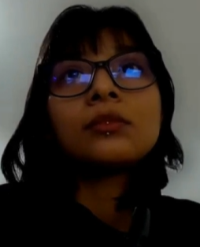

# **Capítulo I: Introducción**
## **1.1. Startup Profile**
### **1.1.1. Descripción de la Startup**

En Perú, el transporte escolar es un sector que, a pesar de su gran importancia para las familias, aún opera de manera manual y carece de sistemas tecnológicos que permitan un seguimiento en tiempo real. Esto provoca que muchos padres sientan una incertidumbre diaria, ya que desean un control más cercano y la certeza de saber si sus hijos abordaron el vehículo o llegaron a su destino con seguridad.

En respuesta a esta realidad, **Creatividad** surge como una startup tecnológica enfocada en revolucionar la seguridad y tranquilidad en el entorno del transporte escolar. Nuestro modelo de negocio propone reemplazar los procesos manuales con herramientas digitales a través de **Children Path**. Children Path reúne a todos los actores involucrados en el transporte escolar en una única plataforma, ofreciendo trazabilidad en tiempo real y brindando a las familias una mayor tranquilidad durante los desplazamientos diarios.

**Misión**

Facilitar la logística y el monitoreo del transporte escolar mediante un entorno digital seguro, en tiempo real e intuitivo, que priorice la tranquilidad de las familias y la eficiencia de los conductores.

**Visión**

Convertirnos en la plataforma líder y referente de seguridad en el transporte escolar, reconocida por ofrecer total transparencia en el transporte de estudiantes en tiempo real.

**Objetivos de la Startup**

- Optimizar la gestión del transporte escolar a través de herramientas digitales que reemplacen los procesos manuales.
- Diseñar una aplicación intuitiva y accesible que facilite la interacción entre padres y conductores.
- Promover la adopción tecnológica en el sector del transporte escolar, fomentando soluciones modernas y eficientes.
- Establecer alianzas estratégicas con instituciones educativas y servicios de transporte para ampliar la cobertura del servicio.

**Valores de la Startup**

- **Seguridad:** Es nuestra máxima prioridad; cada funcionalidad está diseñada para proteger la integridad de los estudiantes y la tranquilidad de los padres.
- **Transparencia:** Compartimos información real y visible sobre cada viaje, generando confianza entre padres, conductores e instituciones.
- **Innovación:** Mejoramos constantemente nuestra plataforma mediante el uso de tecnologías modernas que potencien la experiencia de usuarios y conductores.

### **1.1.2. Perfiles de integrantes del equipo**

<table width="100%">
  <tbody>
      <tr>
      <td width="30%" align="center" valign="middle">
        
         
        <i></i>
      </td>
      <td width="70%" valign="top" style="padding-left: 20px;">
        <h3>Luis Alonso Huaco Oliva</h3>
        
<b>Código de Estudiante: u202417743</b> 

        
<b>Edad: 24</b> 

        
<b>Especialidad: Ingeniería de Software</b> 

         

<b>Sobre mí:</b>

Me apasiona aprender y disfruto adquirir nuevos conocimientos. Tengo conocimientos de HTML y lógica de programación, y actualmente curso las asignaturas de Aplicaciones Web. Me considero una persona que busca aprender las cosas de manera adecuada para poder aplicarlas en diferentes contextos y evitar limitar el conocimiento a un solo tema.

    </tr>
          <tr>
      <td width="30%" align="center" valign="middle">
        
         
        <i></i>
      </td>
      <td width="70%" valign="top" style="padding-left: 20px;">
        <h3>Diana Pareja Caceres</h3>
        
<b>Código de Estudiante: u202422589</b> 

        
<b>Edad: 24</b> 

        
<b>Especialidad: Ingeniería de Software</b> 

         

<b>Sobre mí:</b>

Estudiante de software con alta capacidad de aprendizaje y gusto por la excelencia técnica. Cuento con formación en lógica de programación, HTML y desarrollo de Aplicaciones Web. Me considero una persona meticulosa y orientada al detalle, enfocada en dominar las tecnologías desde su raíz para aplicarlas de forma versátil y con criterio en diversos contextos digitales.

    </tr>
          <tr>
      <td width="30%" align="center" valign="middle">
        
         
        <i></i>
      </td>
      <td width="70%" valign="top" style="padding-left: 20px;">
        <h3>Piero Alejandro Razuri Ucañan</h3>
        
<b>Código de Estudiante: U202213484</b> 

        
<b>Edad: 24</b> 

        
<b>Especialidad: Ingeniería de Software</b> 

         

<b>Sobre mí:</b>

Me apasiona la tecnología y el reto constante de superar mis propios límites. Aunque aún estoy construyendo mi camino y perfeccionando mis habilidades, cuento con bases en lógica de programación, HTML y actualmente continúo aprendiendo en Aplicaciones Web. Me defino como una persona constante y perseverante, con una enorme disposición para aprender de los errores, buscar soluciones con actitud positiva y dar siempre lo mejor de mí en cada proyecto.

    </tr>
           <tr>
      <td width="30%" align="center" valign="middle">
        
         
        <i></i>
      </td>
      <td width="70%" valign="top" style="padding-left: 20px;">
        <h3>Brandon Wilder Soto Palacios</h3>
        
<b>Código de Estudiante: u202315640</b> 

        
<b>Edad: 21</b> 

        
<b>Especialidad: Ingeniería de Software</b> 

         

<b>Sobre mí:</b>

Soy estudiante de la carrera de Ingeniería de Software en la Universidad Peruana de Ciencias Aplicadas. Tengo intereses en la tecnología y su constante evolución. Tengo conocimientos de programación en lenguajes como C++, Python, JavaScript, HTML y CSS. Soy un poco reservado, pero con muchas de ganas de aprender nuevas cosas.

      </td>
    </tr>
  </tbody>
</table>

## **1.2. Solution Profile**
### **1.2.1. Antecedentes y problemática**

El transporte escolar en Perú se ha caracterizado históricamente por un alto nivel de informalidad y la ausencia de estándares tecnológicos. Las familias confían el traslado de sus hijos a terceros basándose en recomendaciones de otros padres, pero carecen de una plataforma dedicada que profesionalice el servicio y brinde visibilidad durante los trayectos. Al no existir un sistema de seguimiento en tiempo real, los padres experimentan una incertidumbre constante, sin saber si los estudiantes abordaron el vehículo de manera segura o llegaron a su destino.

En este contexto, el principal problema que buscamos abordar es la falta de formalización digital en el transporte escolar y la ausencia de un canal de comunicación centralizado que garantice la tranquilidad de los padres. Esta deficiencia no solo afecta emocionalmente a las familias, sino que también genera ineficiencias y riesgos para los conductores, quienes se ven obligados a gestionar la comunicación de forma improvisada y manual mientras operan el vehículo.

**Método 5W y 2H**

* **¿Qué?**

  El problema principal es la falta de organización e información durante la ruta del transporte escolar. Actualmente, los padres dependen de comunicarse con los conductores mediante llamadas o mensajes, lo que supone distracciones peligrosas para el conductor y resultan insuficientes para la tranquilidad de los padres. Además, esto no siempre es efectivo y puede generar confusiones cuando el conductor notifica lo que el padre pregunta, posiblemente debido a errores humanos.

* **¿Quién?**

  Los más afectados son los padres, especialmente aquellos con hijos en educación básica, que no tienen certeza sobre el transporte de sus hijos, y los conductores de transporte escolar, que deben realizar varias tareas al mismo tiempo, lo que puede llevar a cometer errores involuntarios.

* **¿Cuándo?**

  Esta situación ocurre a diario en días escolares durante las horas punta, tanto en el recojo matutino entre las 6:20 a.m. y las 7:10 a.m., como en el regreso vespertino entre las 2:00 p.m. y las 4:00 p.m.

* **¿Dónde?**

  Principalmente en distritos de Lima Metropolitana con alta demanda de transporte escolar y tráfico constante.

* **¿Por qué?**

  Porque los servicios de transporte escolar continúan operando de manera tradicional; es decir, aún no se han incorporado suficientemente herramientas digitales que ayuden a organizar rutas o informar a los padres en tiempo real.

* **¿Cómo?**

  El problema se refleja en tiempos de espera innecesarios, congestión en los puntos de recojo y llamadas constantes al conductor preguntando por su ubicación. Para solucionarlo, proponemos **Children Path**, una aplicación que permite a los usuarios visualizar la ubicación del vehículo escolar y recibir notificaciones sobre el estado del viaje.

* **¿Cuánto?**

  Esto genera mayores costos de tiempo y combustible para los conductores, mientras que para los padres supone una preocupación constante y tiempo perdido esperando sin información clara.

### **1.2.2 Lean UX Process**
#### **1.2.2.1. Lean UX Problem Statements**

**El estado actual del** sector de transporte escolar en Lima Metropolitana **se ha enfocado principalmente en** padres de familia, conductores independientes y administradores de empresas de movilidad escolar, quienes lidian con la incertidumbre sobre el trayecto de los estudiantes, el estrés generado por la congestión vehicular y las distracciones peligrosas al volante provocadas por la coordinación manual de rutas y asistencia mediante llamadas telefónicas, cuadernos y mensajes de WhatsApp.

**Lo que los productos y servicios existentes no logran resolver es** la ausencia de una solución integrada, accesible y de bajo costo que proporcione alertas automatizadas de proximidad y trazabilidad de abordaje en tiempo real sin obligar al conductor a manipular dispositivos móviles mientras opera el vehículo.

**Nuestro producto, Children Path, abordará esta brecha mediante** una plataforma web y móvil que automatiza las notificaciones de llegada y paradas, registra digitalmente la asistencia con mínima interacción del chofer y centraliza el monitoreo en vivo para brindar tranquilidad a las familias y optimizar la logística vehicular.

**Nuestro enfoque inicial se centrará en** conductores independientes y padres de familia de colegios privados en distritos de alta demanda de Lima Metropolitana.

**Sabremos que hemos tenido éxito cuando veamos**, en nuestro grupo de prueba piloto, que al menos el 70% de los padres registrados consulten el estado de la ruta mediante la plataforma, una reducción perceptible de al menos 80% en las llamadas directas al conductor durante los trayectos activos, y que el tiempo promedio de espera por parada no supere los 3 minutos.

#### **1.2.2.2. Lean UX Assumptions**

**Business Assumptions**
* Creemos que existe una demanda insatisfecha y creciente en Lima Metropolitana de padres y conductores que requieren digitalizar y dar trazabilidad al transporte escolar.
* Creemos que los conductores independientes y empresas de movilidad están dispuestos a pagar una tarifa de suscripción mensual accesible a cambio de reducir el estrés operativo y optimizar sus tiempos de ruta.
* Creemos que la principal ventaja competitiva de Children Path frente a soluciones informales (grupos de WhatsApp) o GPS genéricos radica en la automatización de alertas de proximidad y el registro rápido de asistencia en una sola plataforma especializada.
* Creemos que la estrategia más efectiva para adquirir clientes iniciales es la recomendación directa entre conductores de las mismas zonas escolares y la presentación del servicio ante asociaciones de padres de familia (APAFA) de colegios privados.

**Business Outcome Assumptions**
* Lograremos alcanzar una retención superior al 85% de conductores independientes y movilidades afiliadas tras los primeros tres meses de uso continuo.
* Reduciremos en al menos un 80% las llamadas telefónicas y mensajes de mensajería instantánea dirigidos al conductor durante la marcha del vehículo.
* Disminuiremos los tiempos promedio de espera y detención del vehículo en cada punto de recogida a menos de 3 minutos.
* Conseguiremos una tasa de adopción y consulta diaria activa superior al 75% por parte de los padres de familia registrados dentro del piloto.

**User Assumptions**
* Padres de familia: Padres y tutores con hijos en edad escolar (colegios inicial, primaria y secundaria) que trabajan o tienen agendas ajustadas, poseen smartphones con acceso a datos móviles y sienten constante preocupación por la seguridad y puntualidad de sus hijos en los trayectos diarios.
* Conductores de movilidad escolar: Choferes formales o independientes con rutas fijas de colegios que necesitan concentrarse plenamente en el volante sin manipular el celular constantemente para responder consultas de los padres.
* Administradores de empresas de transporte escolar: Encargados de coordinar múltiples unidades vehiculares que requieren supervisar la puntualidad, cumplimiento de itinerarios y control de asistencia de la flota.

**User Outcome and Benefit Assumptions**
* Para los Padres:
* Obtienen tranquilidad y reducen el estrés cotidiano al visualizar la posición del transporte escolar en tiempo real sin tener que interrumpir al conductor.
* Anticipan la salida del hogar mediante notificaciones automáticas previas a la llegada de la unidad, optimizando sus tiempos matutinos.
* Cuentan con confirmación inmediata del abordaje y llegada del menor al colegio o domicilio
  
* Para los Conductores:
* Conducen con mayor seguridad al volante eliminando la necesidad de responder llamadas o audios de WhatsApp en pleno tráfico.
* Ahorran tiempo en paradas y reducen el consumo innecesario de combustible al encontrar a los alumnos listos en la puerta gracias a las alertas de proximidad.
* Simplifican el pase de lista diario a un solo toque en pantalla en lugar de planillas manuales en papel.
* Para los Administradores:
* Visualizan el estado consolidado de su flota en un panel centralizado para detectar demoras e imprevistos de forma proactiva.

**Feature Assumptions**

* Seguimiento GPS en tiempo real: Creemos que proporcionar un mapa interactivo con la ubicación en vivo del vehículo brindará certidumbre continua a los padres durante el recorrido.
* Alertas automatizadas de proximidad (Geocercas): Creemos que enviar notificaciones automáticas cuando la movilidad se encuentre a 5 o 3 minutos de la parada reducirá los tiempos de espera y el uso del claxon en zonas residenciales.
* Registro de asistencia y abordaje en un toque: Creemos que una interfaz táctil rápida y simplificada permitirá al conductor registrar si el alumno abordó, descendió o faltó sin distraer su atención del trayecto.
* Gestión de rutas e incidencias operativas: Creemos que permitir a los administradores registrar rutas optimizadas y comunicar incidencias (tráfico pesado, desvíos) mejorará la coordinación general entre conductores y familias.
  

#### **1.2.2.3. Lean UX Hypothesis Statements**

* **Hipótesis 1:**  
  **Creemos que** lograremos una tasa de adopción y consulta diaria activa superior al 75% por parte de los padres de familia registrados dentro del piloto.  
  **Si** los padres de familia  
  **Obtienen** certidumbre continua y reducen la ansiedad cotidiana al visualizar la posición exacta del transporte escolar durante todo el trayecto  
  **Con** un mapa interactivo con seguimiento GPS en tiempo real integrado en la plataforma web.

* **Hipótesis 2:**  
  **Creemos que** lograremos reducir en al menos un 80% las llamadas y mensajes dirigidos al conductor durante la ruta y disminuir el tiempo de espera por parada a menos de 3 minutos.  
  **Si** los padres de familia y conductores de movilidad escolar  
  **Obtienen** la capacidad de anticipar con precisión la llegada de la unidad para tener a los estudiantes listos en la puerta sin demoras  
  **Con** un sistema de alertas automatizadas de proximidad mediante geocercas.

* **Hipótesis 3:**  
  **Creemos que** lograremos una retención superior al 85% de los conductores independientes afiliados tras los primeros tres meses de uso continuo.  
  **Si** los conductores de movilidad escolar  
  **Obtienen** un método ágil y digital para registrar el abordaje o inasistencia de los alumnos que evite planillas en papel y no genere distracciones al volante  
  **Con** una interfaz táctil simplificada de registro de asistencia en un solo toque.

* **Hipótesis 4:**  
  **Creemos que** lograremos consolidar a la plataforma como la herramienta operativa estándar del servicio, disminuyendo retrasos y reclamos operativos.  
  **Si** los administradores de movilidad escolar y conductores  
  **Obtienen** la supervisión centralizada del cumplimiento de itinerarios y la comunicación oportuna de imprevistos o congestión vehicular  
  **Con** un módulo centralizado de gestión de rutas e incidencias operativas en tiempo real.

#### **1.2.2.4. Lean UX Canvas**

Link del artefacto:
https://miro.com/app/board/uXjVHm5y9BY=/?share_link_id=575806922546

El Lean UX Canvas de Children Path sintetiza los principales problemas identificados en el servicio de transporte escolar en Lima Metropolitana, destacando la falta de digitalización y la dependencia de procesos manuales como el eje central. Esta situación genera rutas desorganizadas, tiempos de espera prolongados e incertidumbre en las familias, además de crear situaciones de alto riesgo al volante cuando los conductores deben atender llamadas o mensajes mientras conducen.

En respuesta, se plantea una solución integral basada en una plataforma web y móvil para padres y conductores que articula tres funcionalidades clave: seguimiento GPS en tiempo real, notificaciones automáticas de proximidad y un registro de asistencia táctil de un solo toque.   El objetivo de negocio se centra en validar un modelo SaaS viable, proyectando una reducción del 80% en llamadas y mensajes hacia el chofer, tiempos de parada inferiores a 3 minutos y una tasa de uso diario superior al 75% en el grupo piloto.

Para mitigar la hipótesis más riesgosa —verificar si los conductores adoptan la herramienta sin generar distracciones en ruta—, se define un MVP centrado en el monitoreo satelital y las alertas automatizadas, el cual será validado en un trayecto de prueba real para evaluar de manera directa la experiencia de conductores y familias.

## **1.3. Segmentos objetivo**
### Segmento #1: Conductores Independientes

- **Aspectos demográficos**
    - **Género:** Masculino y femenino.
    - **Edades:** Entre 20 y 60 años.
    - **Nivel socioeconómico:** Clases B y C.
- **Aspectos geográficos**
    - **Nacionalidad:** Peruana o venezolana.
    - **Área geográfica:** Urbana, con rutas que cubren de 2 a 3 distritos cercanos.
    - **Departamento:** Lima Metropolitana.
- **Aspectos psicográficos**
    - Su negocio depende completamente de la confianza de los padres y de las recomendaciones de boca a boca.
    - Se sienten frustrados por la pérdida de tiempo y combustible al esperar a estudiantes que tardan en salir o faltan sin previo aviso.
    - Prefieren herramientas tecnológicas directas e intuitivas.
- **Información estadística de apoyo**
    - Lima es considerada la ciudad con mayor congestión vehicular de América y se encuentra entre las 10 primeras a nivel mundial. Esto provoca que un conductor promedio pierda aproximadamente 254 horas al año en el tráfico (El Comercio, 2023). En este contexto, permanecer detenido por largos periodos con el motor en marcha aumenta considerablemente el consumo de combustible, reduciendo la rentabilidad diaria y haciendo menos eficiente el trabajo de los conductores de transporte escolar.

### Segmento #2: Empresas Dedicadas al Transporte Escolar

- **Aspectos demográficos**
    - **Perfil:** Dueños o administradores de pequeñas flotas.
    - **Edades:** Entre 30 y 60 años.
    - **Nivel socioeconómico:** Clases A y B.
- **Aspectos geográficos**
    - **Nacionalidad:** Peruana o venezolana.
    - **Área geográfica:** Urbana, operando diferentes rutas para varios colegios.
    - **Departamento:** Lima Metropolitana.
- **Aspectos psicográficos**
    - Su principal objetivo es la eficiencia operativa y la rentabilidad.
    - Buscan formalizar y estandarizar su servicio para obtener contratos con instituciones educativas privadas.
    - Necesitan paneles administrativos para monitorear a sus conductores en tiempo real y justificar la calidad de su servicio.
- **Información estadística de apoyo**
    - Para las pequeñas y medianas empresas del sector transporte, no contar con herramientas digitales hace que su trabajo sea más lento y costoso. Incorporar soluciones tecnológicas puede ayudarles a organizar mejor sus operaciones y reducir gastos innecesarios (Ministerio de Transportes y Comunicaciones, s.f.). De esta manera, las empresas de transporte escolar necesitan apoyarse en herramientas que les permitan monitorear sus unidades, mejorar sus tiempos y ser más competitivas en el mercado.

### Segmento #3: Padres de Familia

- **Aspectos demográficos**
    - **Género:** Masculino y femenino.
    - **Edades:** Entre 25 y 50 años (padres de niños en edad escolar, principalmente de educación inicial y primaria).
    - **Nivel socioeconómico:** Clases A, B y C.
- **Aspectos geográficos**
    - **Nacionalidad:** Peruana.
    - **Área geográfica:** Urbana, residentes en distritos de Lima Metropolitana con alta demanda de transporte escolar.
    - **Departamento:** Lima Metropolitana.
- **Aspectos psicográficos**
    - Su principal preocupación es la seguridad y el bienestar de sus hijos durante el traslado al colegio.
    - Valoran la transparencia y la comunicación clara con el conductor o la empresa de transporte.
    - Suelen tener horarios laborales ocupados y buscan soluciones que les ahorren tiempo y les brinden tranquilidad sin requerir su intervención constante.
    - Están familiarizados con el uso de aplicaciones móviles y esperan recibir notificaciones e información en tiempo real.
- **Información estadística de apoyo**
    - Según una encuesta realizada por Ipsos Perú (2022), el 78% de los padres de familia en Lima Metropolitana considera que la inseguridad en las calles es uno de sus principales temores al enviar a sus hijos al colegio. Asimismo, el 65% manifestó que le gustaría contar con una herramienta que le permita saber la ubicación exacta del vehículo escolar durante el trayecto. Estos datos reflejan la alta demanda de soluciones que ofrezcan visibilidad y control, justamente lo que Children Path busca proporcionar.
