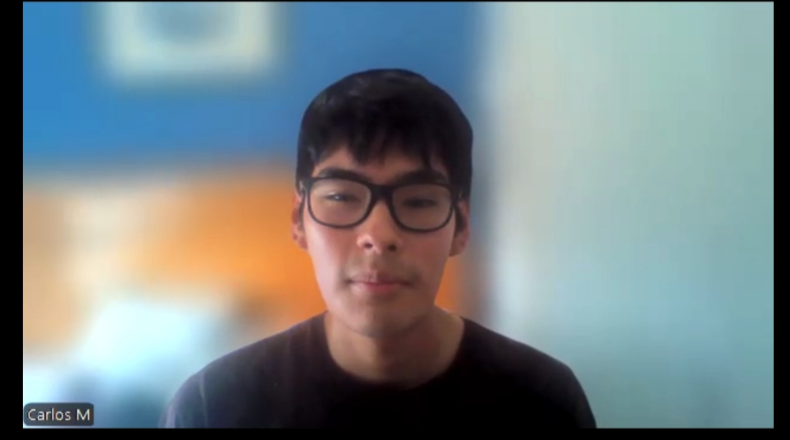
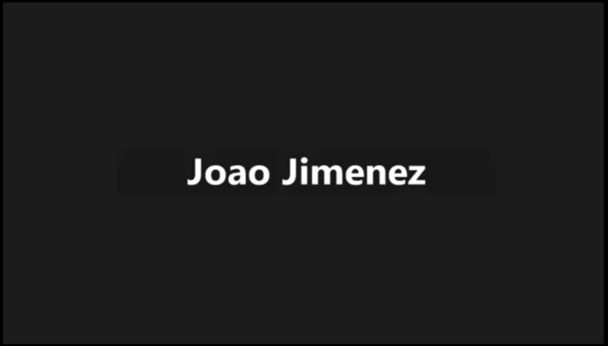
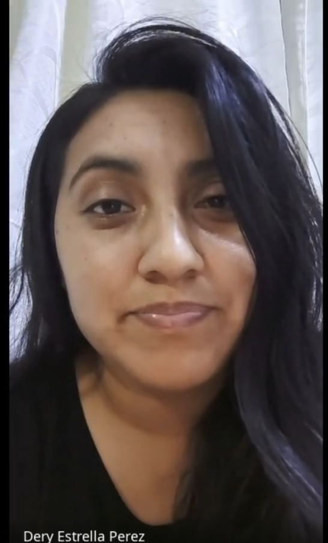
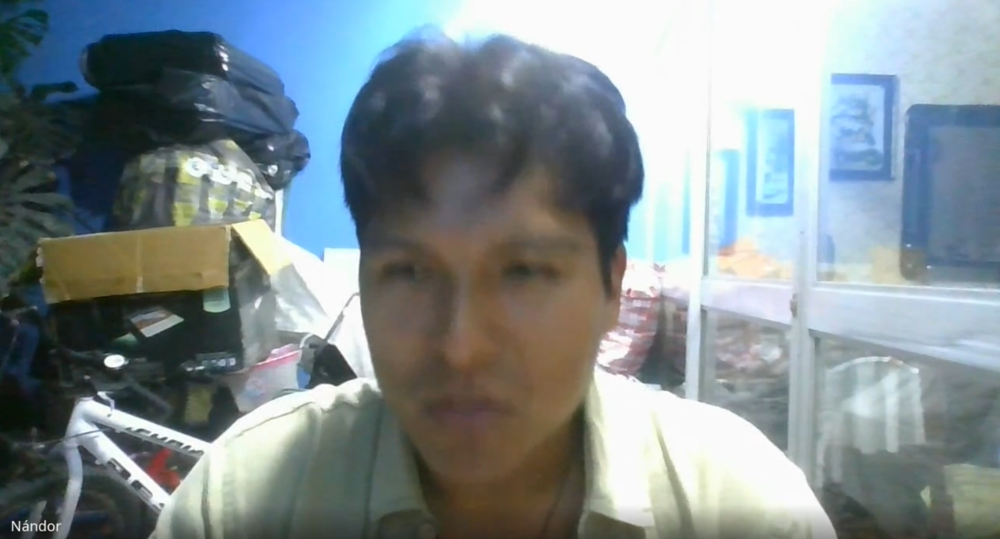
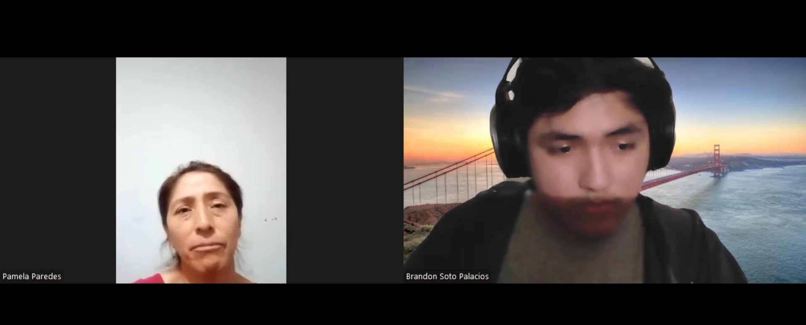
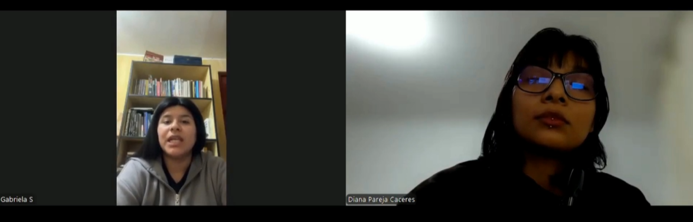
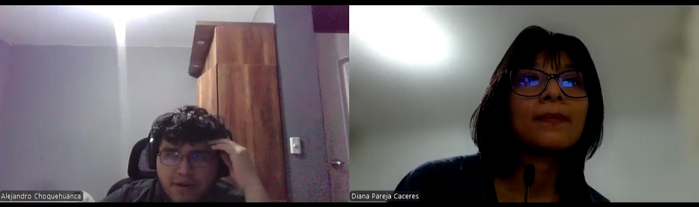
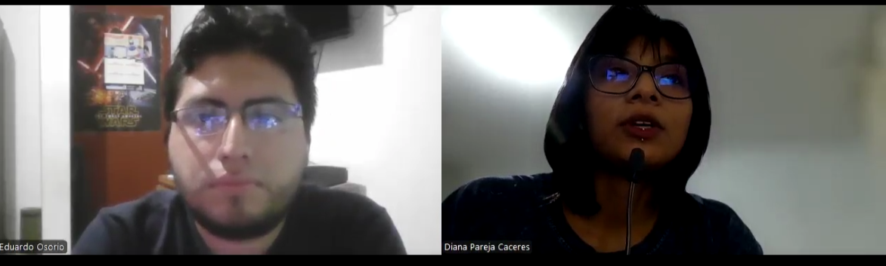

# **Chapter II: Requirements Elicitation & Analysis**

## **2.1. Competidores**

**OnTrack School**

OnTrack School es una plataforma desarrollada en Latinoamérica que ayuda a gestionar el transporte escolar de manera más segura y organizada. Permite a los padres visualizar la ubicación del vehículo escolar en tiempo real, mientras que los colegios y las empresas pueden monitorear la asistencia de los estudiantes. Esto la convierte en una herramienta útil para mejorar la comunicación y el seguimiento del servicio (OnTrack, s.f()).

**titiGO**

titiGO es una plataforma peruana diseñada para el rastreo y control del transporte escolar. Su propuesta permite a las familias recibir notificaciones en tiempo real sobre el estado del viaje de cada estudiante, registrando cuándo abordan el vehículo, llegan al colegio o regresan a casa. Además, utiliza un sistema de control de salida mediante un código QR único, buscando brindar seguridad completa en la comunicación y confianza para los padres (titiGO, 2026).

**BatOnRoute**

BatOnRoute es un software de origen europeo que ayuda a gestionar las rutas del transporte escolar. Permite a los colegios y empresas conocer la ubicación de los vehículos en tiempo real, mantener el control de asistencia y enviar notificaciones a los padres cuando el vehículo escolar se encuentra cerca. Su enfoque está en mejorar la organización del servicio y brindar mayor seguridad a todos los involucrados (BatOnRoute, s.f()).

### **2.1.1. Análisis Competitivo**

**Panorama del Análisis Competitivo**

<table width="100%">
  <thead>
    <tr>
      <th align="left" width="20%">
        ¿Por qué realizar este análisis?
      </th>
      <th colspan="4" align="left">
        Identificar las limitaciones en el uso y nivel de automatización de las plataformas actuales de transporte escolar, con el fin de definir una propuesta que facilite la labor del conductor y reduzca las distracciones durante la ruta.
      </th>
    </tr>
    <tr>
      <th align="left"></th>
      <th align="center">
        Children Path 
        
      </th>
      <th align="center">
        titiGO 
        
      </th>
      <th align="center">
        BatOnRoute 
        
      </th>
      <th align="center">
        OnTrack School 
        
      </th>
    </tr>
  </thead>
  <tbody>
    <tr>
      <th colspan="5" align="left">Perfil</th>
    </tr>
    <tr>
      <td><b>Descripción general</b></td>
      <td>Software que automatiza la comunicación entre conductores y padres mediante alertas de proximidad.</td>
      <td>Aplicación peruana enfocada en el control del transporte escolar mediante estados de viaje y validación por QR.</td>
      <td>Software orientado a empresas que gestiona flotas escolares con rastreo en tiempo real y alertas.</td>
      <td>Sistema latinoamericano que permite monitorear rutas escolares y llevar el control de asistencia.</td>
    </tr>
    <tr>
      <td><b>Ventaja competitiva (¿Qué valor ofrece a los clientes?)</b></td>
      <td>Envía alertas automáticas sin requerir que el conductor use el teléfono, evitando distracciones y reduciendo los tiempos de espera.</td>
      <td>Controla la salida de los estudiantes mediante códigos QR para mayor seguridad.</td>
      <td>Está diseñado para gestionar muchas unidades y rutas complejas.</td>
      <td>Ofrece rastreo constante de la ruta con un enfoque adaptado a la región.</td>
    </tr>
    <tr>
      <th colspan="5" align="left">Perfil de Marketing</th>
    </tr>
    <tr>
      <td><b>Mercado objetivo</b></td>
      <td>Conductores independientes y pequeñas empresas de transporte en Lima.</td>
      <td>Colegios y padres interesados en controlar la asistencia de los estudiantes.</td>
      <td>Directores de colegios privados con mayor poder adquisitivo.</td>
      <td>Colegios, empresas de transporte y familias.</td>
    </tr>
    <tr>
      <td><b>Estrategias de marketing</b></td>
      <td>Promoción mediante recomendaciones y asociaciones de padres de familia (APAFA).</td>
      <td>Trabajo directo con colegios para que adopten la app como parte de su sistema.</td>
      <td>Venta directa a instituciones mostrando los beneficios del servicio.</td>
      <td>Enfoque en la seguridad y organización del transporte escolar para atraer usuarios.</td>
    </tr>
    <tr>
      <th colspan="5" align="left">Perfil del Producto</th>
    </tr>
    <tr>
      <td><b>Productos y servicios</b></td>
      <td>App para padres y conductores, ubicación en tiempo real y panel web con control de asistencia.</td>
      <td>App de rastreo con registro digital y validación por QR.</td>
      <td>Plataforma web, apps y herramientas para organizar rutas.</td>
      <td>Aplicaciones móviles, panel administrativo e informes de ruta.</td>
    </tr>
    <tr>
      <td><b>Precios y costos</b></td>
      <td>Planes según la cantidad de estudiantes y vehículos.</td>
      <td>Planes de suscripción según la cantidad de estudiantes.</td>
      <td>Planes más costosos con contratos institucionales.</td>
      <td>Suscripción según las funcionalidades del sistema.</td>
    </tr>
    <tr>
      <td><b>Canales de distribución (Web y/o móvil)</b></td>
      <td>Aplicación móvil y plataforma web.</td>
      <td>Aplicación móvil y plataforma web.</td>
      <td>Aplicación móvil y plataforma web.</td>
      <td>Aplicación móvil y plataforma web.</td>
    </tr>
    <tr>
      <th colspan="5" align="left">Análisis FODA</th>
    </tr>
    <tr>
      <td><b>Fortalezas</b></td>
      <td>Automatización de alertas de proximidad con mínima interacción del conductor</td>
      <td>Fuerte enfoque en la seguridad institucional mediante códigos QR físicos</td>
      <td>Software robusto para gestionar grandes flotas escolares</td>
      <td>Amplio alcance regional y monitoreo consolidado</td>
    </tr>
    <tr>
      <td><b>Debilidades</b></td>
      <td>Marca nueva sin validación institucional a gran escala</td>
      <td>Requiere interacción manual constante mediante escaneo de QR</td>
      <td>Complejo y costoso para conductores independientes</td>
      <td>Interfaz genérica con poca adaptación a contextos locales específicos</td>
    </tr>
    <tr>
      <td><b>Oportunidades</b></td>
      <td>Alta necesidad de reducir distracciones en conductores urbanos</td>
      <td>Creciente interés en la digitalización de la seguridad escolar</td>
      <td>Expansión hacia colegios privados de alto nivel</td>
      <td>Crecimiento del mercado de transporte escolar en LATAM</td>
    </tr>
    <tr>
      <td><b>Amenazas</b></td>
      <td>Resistencia al cambio tecnológico en conductores mayores</td>
      <td>Problemas de lectura de QR en condiciones adversas</td>
      <td>Competidores más económicos en el segmento de pymes</td>
      <td>Dificultad para adaptar soluciones globales a nichos locales</td>
    </tr>
  </tbody>
</table>

### **2.1.2. Estrategias y tácticas frente a competidores**

En una ciudad como Lima Metropolitana, donde el tráfico y el desorden del transporte son parte de la vida cotidiana, en **Children Path** buscamos diferenciarnos ofreciendo una solución más simple y útil para padres y conductores en comparación con otras aplicaciones del sector. No nos enfocamos únicamente en la ubicación en tiempo real, sino también en mejorar la seguridad y la tranquilidad durante toda la ruta.

**Fortalezas**

* **Automatización de alertas**

  A diferencia de los métodos actuales, como llamadas o mensajes de WhatsApp, la aplicación envía notificaciones automáticas cuando el vehículo escolar está cerca o llega al destino. Esto permite que el conductor evite usar el teléfono mientras conduce y se concentre en la ruta.

* **Información clara y confiable para los padres**

  Los padres pueden visualizar la ruta sin necesidad de llamar ni escribir mensajes. Esto les brinda mayor tranquilidad y confianza durante el transporte de sus hijos. Además, pueden acceder a información en tiempo real.

**Debilidades**

* **Baja presencia en el mercado**

  Como somos una startup nueva, aún no contamos con una marca reconocida. Para generar confianza, se realizarán pruebas piloto con algunos usuarios y se compartirán sus experiencias para demostrar que nuestra solución es sólida y vale la pena adoptarla.

* **Dependencia de Internet**

  En algunas zonas de Lima, la señal puede fallar, lo que afecta las actualizaciones en tiempo real. Para reducir este problema, la aplicación se optimizará para consumir pocos datos y almacenar información cuando no haya señal.

**Oportunidades**

* **Problemas de tráfico y seguridad**

  El tráfico en Lima hace que los tiempos de viaje sean impredecibles. La aplicación puede ayudar a los padres a saber cuándo llegará el vehículo escolar y reducir el tiempo de espera en la calle.

* **Mayor uso de la tecnología**

  Cada vez más servicios se están digitalizando, lo que permite que soluciones como **Children Path** sean mejor aceptadas por conductores y empresas de transporte.

**Amenazas**

* **Competencia de otras plataformas**

  Existen aplicaciones más desarrolladas en otros países. Frente a esto, **Children Path** se enfocará en adaptarse mejor a la realidad local, con precios accesibles y soluciones más cercanas al contexto local.

* **Resistencia al cambio**

  Algunos conductores prefieren seguir utilizando métodos tradicionales. Por ello, la aplicación será sencilla de usar y brindará una explicación clara de sus beneficios.

## **2.2. Entrevistas**

### **2.2.1. Diseño de las Entrevistas**

Con el fin de obtener información cualitativa que nos ayude a validar nuestras ideas y comprender mejor a los usuarios, se diseñaron tres entrevistas para cada grupo objetivo de la plataforma **Children Path**. Las preguntas fueron planificadas para obtener respuestas abiertas, evitando en lo posible las respuestas de sí o no. Además, se organizaron en bloques para conocer los perfiles de los usuarios, sus hábitos tecnológicos, los problemas que enfrentan y lo que esperan de un servicio de transporte escolar.

**Segmento #1: Conductores Independientes**

Se presentan, se pide consentimiento para entrevistar al participante y se comienza:

1. ¿Podría indicarnos su edad, distrito de residencia y cuántos años lleva trabajando como conductor de transporte escolar?
2. ¿Qué marca y modelo de vehículo conduce actualmente? ¿Es propio o lo alquila?
3. En su rutina diaria, ¿qué aplicaciones utiliza más en su teléfono? Algunos ejemplos son Waze, WhatsApp o redes sociales.
4. ¿Cómo organiza el orden de su ruta cada mañana? ¿Utiliza alguna herramienta digital o se basa en su memoria?
5. Descríbanos su experiencia conduciendo en hora punta en Lima. ¿Cómo afecta el tráfico a su estado de ánimo y a la puntualidad?
6. ¿Qué es lo que más le molesta cuando llega a recoger a un estudiante y este no está listo en la puerta?
7. ¿Cuántas veces al día recibe llamadas o mensajes de los padres preguntando por su ubicación mientras conduce?
8. ¿Ha tenido alguna vez una distracción peligrosa porque intentó responder el teléfono para avisar que ya estaba cerca de un domicilio?
9. Si una aplicación notificara automáticamente a los padres cuando usted estuviera a 5 minutos de su casa sin que usted tenga que hacer nada, ¿cómo cambiaría su jornada laboral?
10. ¿Qué tan importante es para usted que la aplicación sea extremadamente sencilla de usar, por ejemplo, con botones grandes y que no lo distraiga al conducir?
11. ¿Qué beneficio económico o de tiempo esperaría obtener al utilizar una plataforma como la nuestra?

**Segmento #2: Empresas Dedicadas al Transporte Escolar**

Se presentan, se pide consentimiento para entrevistar al participante y se comienza:

1. ¿Cuál es el nombre de la empresa, cuántas unidades tiene actualmente en su flota y en qué distritos de Lima operan principalmente?
2. ¿Cuál es su cargo dentro de la empresa y cuáles son sus principales desafíos logísticos diarios?
3. ¿Qué métodos utilizan actualmente para supervisar si sus conductores están siguiendo las rutas y horarios establecidos?
4. ¿Cómo manejan los registros de asistencia de los estudiantes? Por ejemplo, ¿es manual, en papel o cuentan con un sistema digital?
5. ¿Cuál es el costo operativo más alto al que se enfrentan, como combustible, mantenimiento o multas, y cómo intentan reducirlo?
6. ¿Qué tipo de quejas reciben con mayor frecuencia por parte de los padres?
7. ¿Qué tan valioso sería para su empresa contar con un panel centralizado donde pueda ver todas sus unidades en un solo mapa en tiempo real?
8. ¿Cómo cree que ofrecer a los padres una aplicación para monitorear el bus de sus hijos impactaría en su confianza?
9. Para adoptar una solución como **Children Path**, ¿qué tipo de informes o datos estadísticos necesitaría que la plataforma les proporcione mensualmente?

**Segmento #3: Padres de Familia**

Se presentan, se pide consentimiento para entrevistar al participante y se comienza:

1. ¿Podría indicarnos su edad, el distrito donde reside y la edad y grado escolar de su(s) hijo(s) que utilizan el transporte escolar?
2. Actualmente, ¿cómo se organiza con el recojo y retorno de sus hijos? ¿Sale a esperarlos, confía en el horario del conductor o utiliza alguna aplicación?
3. ¿Qué aplicaciones móviles utiliza con mayor frecuencia en su día a día (por ejemplo, WhatsApp, Waze, redes sociales, aplicaciones del colegio)?
4. Descríbanos su experiencia actual con el servicio de transporte escolar. ¿Qué es lo que más le preocupa o le genera incertidumbre durante el viaje de sus hijos?
5. ¿Cuántas veces al día suele comunicarse con el conductor para preguntar por la ubicación o el estado del viaje de sus hijos?
6. ¿Ha tenido experiencias donde el conductor llegó tarde, no pasó por su hijo o hubo confusión con los horarios? ¿Cómo manejó esa situación?
7. ¿Qué opina sobre la seguridad vial y el uso del celular por parte del conductor? ¿Le genera preocupación saber que el conductor podría distraerse al atender llamadas o mensajes de los padres?
8. Si existiera una aplicación que le mostrara en un mapa la ubicación exacta del vehículo en tiempo real y le notificara automáticamente cuando está cerca de su casa, sin que el conductor tenga que llamarle, ¿cómo cambiaría su rutina matutina?
9. Además de la ubicación, ¿qué otra información le gustaría recibir, como la confirmación de que su hijo abordó el vehículo o llegó al colegio?
10. ¿Estaría dispuesto a pagar una suscripción mensual por un servicio que le brinde esta tranquilidad y seguridad? ¿Cuánto consideraría justo pagar?
11. ¿Qué característica de la aplicación sería la más importante para usted para sentirse tranquilo al confiar el transporte de su hijo a un conductor registrado en nuestra plataforma?

### **2.2.2. Registro de Entrevistas**

**Segmento 1: Conductores Independientes**

<table width="100%">
  <thead>
    <tr>
      <th colspan="2" align="center"><h2>Entrevista #1</h2></th>
    </tr>
  </thead>
  <tbody>
    <tr>
      <th colspan="2" align="left">Datos del Entrevistado</th>
    </tr>
    <tr>
      <td width="30%"><b>Nombre Completo</b></td>
      <td>Carlos Marcelo Mansilla Rivero</td>
    </tr>
    <tr>
      <td><b>Edad</b></td>
      <td>24 años</td>
    </tr>
    <tr>
      <td><b>Ocupación</b></td>
      <td>Conductor de transporte escolar</td>
    </tr>
    <tr>
      <td><b>Distrito de residencia</b></td>
      <td>Surquillo</td>
    </tr>
    <tr>
      <th colspan="2" align="left">Datos del Video</th>
    </tr>
    <tr>
      <td><b>Enlace</b></td>
      <td><a href="https://upcedupe-my.sharepoint.com/:v:/g/personal/u202417743_upc_edu_pe/IQBHn8n5K9_6Rp66hsgbrEJoAdhlFwMApCasikED2GfGumQ?nav=eyJyZWZlcnJhbEluZm8iOnsicmVmZXJyYWxBcHAiOiJPbmVEcml2ZUZvckJ1c2luZXNzIiwicmVmZXJyYWxBcHBQbGF0Zm9ybSI6IldlYiIsInJlZmVycmFsTW9kZSI6InZpZXciLCJyZWZlcnJhbFZpZXciOiJNeUZpbGVzTGlua0NvcHkifX0&e=mazujd">Entrevista</a></td>
    </tr>
    <tr>
      <td><b>Duración</b></td>
      <td>4:53 minutos</td>
    </tr>
    <tr>
      <td><b>Empieza en el:</b></td>
      <td>7:20</td>
    </tr>
    <tr>
      <th colspan="2" align="center">Captura de pantalla</th>
    </tr>
    <tr>
      <td colspan="2" align="center">
        
      </td>
    </tr>
  </tbody>
</table>

**Resumen de la Entrevista**

Carlos es un conductor de transporte escolar con poca experiencia en el rubro, por lo que aún depende de herramientas como Waze o Google Maps para organizar sus rutas y evitar errores. En su rutina diaria, se enfoca en recoger a los estudiantes, mantener la puntualidad y coordinar constantemente con los padres a través de WhatsApp. Sin embargo, enfrenta varios problemas como la falta de puntualidad de algunos estudiantes, lo que afecta toda su ruta, y el denso tráfico de Lima, que incrementa su estrés y dificulta cumplir con los horarios. Además, le preocupa su imagen frente a los padres porque, al ser un conductor nuevo, siente mayor presión por demostrar responsabilidad y generar confianza.

Otro punto crítico es la comunicación con los padres, ya que recibe constantemente mensajes y llamadas preguntando por su ubicación. Esto lo obliga a responder mientras conduce, generando distracciones peligrosas. Ante esta situación, valora mucho una solución que automatice las alertas de proximidad, lo que le ayudaría a concentrarse en la conducción y reducir el estrés. También enfatiza que la herramienta debe ser muy sencilla de usar, con mínima interacción, porque está al volante. Finalmente, espera que dicha solución le ayude a mejorar su reputación, optimizar su tiempo y reducir costos como el consumo de combustible causado por esperas innecesarias.

<table width="100%">
  <thead>
    <tr>
      <th colspan="2" align="center"><h2>Entrevista #2</h2></th>
    </tr>
  </thead>
  <tbody>
    <tr>
      <th colspan="2" align="left">Datos del Entrevistado</th>
    </tr>
    <tr>
      <td width="30%"><b>Nombre Completo</b></td>
      <td>Mateo Nicolás de Mendiburu Aguilar</td>
    </tr>
    <tr>
      <td><b>Edad</b></td>
      <td>20 años</td>
    </tr>
    <tr>
      <td><b>Ocupación</b></td>
      <td>Conductor de transporte escolar</td>
    </tr>
    <tr>
      <td><b>Distrito de residencia</b></td>
      <td>Santiago de Surco</td>
    </tr>
    <tr>
      <th colspan="2" align="left">Datos del Video</th>
    </tr>
    <tr>
      <td><b>Enlace</b></td>
      <td><a href="https://upcedupe-my.sharepoint.com/:v:/g/personal/u202417743_upc_edu_pe/IQBHn8n5K9_6Rp66hsgbrEJoAdhlFwMApCasikED2GfGumQ?nav=eyJyZWZlcnJhbEluZm8iOnsicmVmZXJyYWxBcHAiOiJPbmVEcml2ZUZvckJ1c2luZXNzIiwicmVmZXJyYWxBcHBQbGF0Zm9ybSI6IldlYiIsInJlZmVycmFsTW9kZSI6InZpZXciLCJyZWZlcnJhbFZpZXciOiJNeUZpbGVzTGlua0NvcHkifX0&e=mazujd">Entrevista</a></td>
    </tr>
    <tr>
      <td><b>Duración</b></td>
      <td>6.20 minutos</td>
    </tr>
    <tr>
      <td><b>Empieza en el:</b></td>
      <td>12:06</td>
    </tr>
    <tr>
      <th colspan="2" align="center">Captura de pantalla</th>
    </tr>
    <tr>
      <td colspan="2" align="center">
        
      </td>
    </tr>
  </tbody>
</table>

**Resumen de la Entrevista**

Mateo es un conductor de transporte escolar con aproximadamente dos años de experiencia que opera principalmente en distritos como Surco. En su rutina diaria, combina el uso de herramientas digitales como Google Maps con su propio conocimiento de las rutas, además de usar un calendario para organizar sus viajes. Esta mezcla de soporte tecnológico y experiencia le permite optimizar su trabajo, aunque todavía depende de las condiciones del entorno, especialmente el tráfico en hora punta, que representa uno de sus mayores desafíos y afecta directamente su puntualidad y su nivel de estrés.

Durante sus rutas, uno de los principales problemas que enfrenta es la falta de puntualidad de algunos estudiantes cuando los padres no le avisan con anticipación, lo que genera retrasos acumulados y desorden en toda la ruta. A esto se suma la comunicación constante con los padres, quienes frecuentemente lo contactan no solo para preguntar por su ubicación, sino también por situaciones imprevistas como objetos olvidados. Esta situación lo obliga a dividir su atención entre conducir, responder mensajes y supervisar a los estudiantes dentro del vehículo, creando una sobrecarga que afecta tanto su desempeño como la seguridad durante el viaje.

En este contexto, Mateo valora muy positivamente una solución que automatice la comunicación con los padres, especialmente mediante alertas de proximidad, ya que reduciría significativamente las interrupciones y le permitiría concentrarse en la conducción. Además, destaca la importancia de que la aplicación sea simple, visual y fácil de usar, con elementos grandes que no causen distracción. Finalmente, espera que una herramienta como **Children Path** le ayude a optimizar su tiempo, reducir el consumo de combustible y hacer su trabajo más eficiente, mejorando también la experiencia de padres y estudiantes y fortaleciendo su servicio.

<table width="100%">
  <thead>
    <tr>
      <th colspan="2" align="center"><h2>Entrevista #3</h2></th>
    </tr>
  </thead>
  <tbody>
    <tr>
      <th colspan="2" align="left">Datos del Entrevistado</th>
    </tr>
    <tr>
      <td width="30%"><b>Nombre Completo</b></td>
      <td>Joao David Jiménez Abarca</td>
    </tr>
    <tr>
      <td><b>Edad</b></td>
      <td>36 años</td>
    </tr>
    <tr>
      <td><b>Ocupación</b></td>
      <td>Conductor de transporte escolar</td>
    </tr>
    <tr>
      <td><b>Distrito de residencia</b></td>
      <td>Comas</td>
    </tr>
    <tr>
      <th colspan="2" align="left">Datos del Video</th>
    </tr>
    <tr>
      <td><b>Enlace</b></td>
      <td><a href="https://upcedupe-my.sharepoint.com/:v:/g/personal/u202417743_upc_edu_pe/IQBHn8n5K9_6Rp66hsgbrEJoAdhlFwMApCasikED2GfGumQ?nav=eyJyZWZlcnJhbEluZm8iOnsicmVmZXJyYWxBcHAiOiJPbmVEcml2ZUZvckJ1c2luZXNzIiwicmVmZXJyYWxBcHBQbGF0Zm9ybSI6IldlYiIsInJlZmVycmFsTW9kZSI6InZpZXciLCJyZWZlcnJhbFZpZXciOiJNeUZpbGVzTGlua0NvcHkifX0&e=mazujd">Entrevista</a></td>
    </tr>
    <tr>
      <td><b>Duración</b></td>
      <td>4.33 minutos</td>
    </tr>
    <tr>
      <td><b>Empieza en el:</b></td>
      <td>18:26</td>
    </tr>
    <tr>
      <th colspan="2" align="center">Captura de pantalla</th>
    </tr>
    <tr>
      <td colspan="2" align="center">
        
      </td>
    </tr>
  </tbody>
</table>

**Resumen de la Entrevista**

Joao es un conductor de transporte escolar con varios años de experiencia, lo que le permite organizar sus rutas principalmente de memoria, recurriendo ocasionalmente a herramientas como Waze para evitar el tráfico. Su rutina diaria consiste en recoger a los estudiantes respetando los horarios establecidos, aunque las condiciones del tráfico en Lima suelen generarle estrés y retrasos. A diferencia de algunos conductores más nuevos, maneja mejor la dinámica del servicio relacionada con la puntualidad, pero aún se ve afectado cuando los estudiantes no están listos a tiempo, ya que esto puede alterar su planificación, aunque trata de adaptarse a la situación.

Uno de los principales desafíos que enfrenta es la comunicación constante con los padres, recibiendo varias llamadas al día preguntando por su ubicación. Esto lo pone en una situación difícil porque, aunque entiende la preocupación de los padres, responder mientras conduce representa un riesgo para él y para los estudiantes. Por esta razón, considera que una solución que automatice las alertas sería de mucha ayuda, ya que reduciría las interrupciones y le permitiría concentrarse en la conducción. También destaca la importancia de que la aplicación sea simple y accesible para todo tipo de conductores. Finalmente, menciona que espera que dicha herramienta le ayude a ahorrar tiempo en sus rutas, evitar retrasos y mejorar su reputación, incluso permitiéndole asumir más servicios.

**Segmento 2: Empresas Dedicadas al Transporte Escolar**

<table width="100%">
  <thead>
    <tr>
      <th colspan="2" align="center"><h2>Entrevista #1</h2></th>
    </tr>
  </thead>
  <tbody>
    <tr>
      <th colspan="2" align="left">Datos del Entrevistado</th>
    </tr>
    <tr>
      <td width="30%"><b>Nombre Completo</b></td>
      <td>Dery Estrella Perez</td>
    </tr>
    <tr>
      <td><b>Edad</b></td>
      <td>27 años</td>
    </tr>
    <tr>
      <td><b>Ocupación</b></td>
      <td>Dueña y conductora de una pequeña empresa familiar</td>
    </tr>
    <tr>
      <td><b>Distrito de residencia</b></td>
      <td>Los Olivos</td>
    </tr>
    <tr>
      <th colspan="2" align="left">Datos del Video</th>
    </tr>
    <tr>
      <td><b>Enlace</b></td>
      <td><a href="https://upcedupe-my.sharepoint.com/:v:/g/personal/u202417743_upc_edu_pe/IQBHn8n5K9_6Rp66hsgbrEJoAdhlFwMApCasikED2GfGumQ?nav=eyJyZWZlcnJhbEluZm8iOnsicmVmZXJyYWxBcHAiOiJPbmVEcml2ZUZvckJ1c2luZXNzIiwicmVmZXJyYWxBcHBQbGF0Zm9ybSI6IldlYiIsInJlZmVycmFsTW9kZSI6InZpZXciLCJyZWZlcnJhbFZpZXciOiJNeUZpbGVzTGlua0NvcHkifX0&e=mazujd">Entrevista</a></td>
    </tr>
    <tr>
      <td><b>Duración</b></td>
      <td>4:09 minutos</td>
    </tr>
    <tr>
      <td><b>Empieza en el:</b></td>
      <td>22:53</td>
    </tr>
    <tr>
      <th colspan="2" align="center">Captura de pantalla</th>
    </tr>
    <tr>
      <td colspan="2" align="center">
        
      </td>
    </tr>
  </tbody>
</table>

**Resumen de la Entrevista**

Dery Estrella Perez es la dueña y conductora de una pequeña empresa familiar de transporte escolar con una flota de cinco unidades, que opera principalmente en Los Olivos y San Martín de Porres. En su rutina diaria, enfrenta desafíos como evitar zonas con obras viales constantes y mantener la puntualidad al recoger y dejar a los estudiantes. Al ser un equipo pequeño, la coordinación es bastante directa, apoyándose en llamadas entre conductores para reportar retrasos o problemas en la ruta.

La supervisión de las unidades es completamente manual y depende de la comunicación constante entre el equipo. Asimismo, los registros de asistencia se llevan en cuadernos individuales por cada conductor, lo que crea un sistema poco centralizado y propenso a errores o pérdida de información. Aunque esta forma de trabajar es funcional, limita la capacidad de tener una visión general en tiempo real del servicio.

En cuanto a los costos, los principales problemas están relacionados con el consumo de combustible y las multas, que intentan reducir buscando rutas alternas para evitar el tráfico. Desde el lado de la atención al cliente, el principal punto de tensión es la incertidumbre de los padres, ya que llaman con frecuencia cuando perciben retrasos, generando presión adicional en los conductores mientras están al volante.

Dery ve un alto valor en contar con un sistema más organizado, como un panel centralizado que le permita ver la ubicación de sus unidades y reaccionar rápidamente ante imprevistos, como fallas mecánicas. También cree que una aplicación para padres brindaría tranquilidad y mejoraría la seguridad percibida del servicio. Esperaría que nuestra solución incluya reportes claros sobre incidencias en ruta y asistencia mensual, ayudándole a mantener un mejor control operativo y administrativo.

<table width="100%">
  <thead>
    <tr>
      <th colspan="2" align="center"><h2>Entrevista #2</h2></th>
    </tr>
  </thead>
  <tbody>
    <tr>
      <th colspan="2" align="left">Datos del Entrevistado</th>
    </tr>
    <tr>
      <td width="30%"><b>Nombre Completo</b></td>
      <td>Cheyla Paredes Mattos</td>
    </tr>
    <tr>
      <td><b>Edad</b></td>
      <td>27 años</td>
    </tr>
    <tr>
      <td><b>Ocupación</b></td>
      <td>Administradora de empresa de transporte escolar</td>
    </tr>
    <tr>
      <td><b>Distrito de residencia</b></td>
      <td>Ate</td>
    </tr>
    <tr>
      <th colspan="2" align="left">Datos del Video</th>
    </tr>
    <tr>
      <td><b>Enlace</b></td>
      <td><a href="https://upcedupe-my.sharepoint.com/:v:/g/personal/u202417743_upc_edu_pe/IQBHn8n5K9_6Rp66hsgbrEJoAdhlFwMApCasikED2GfGumQ?nav=eyJyZWZlcnJhbEluZm8iOnsicmVmZXJyYWxBcHAiOiJPbmVEcml2ZUZvckJ1c2luZXNzIiwicmVmZXJyYWxBcHBQbGF0Zm9ybSI6IldlYiIsInJlZmVycmFsTW9kZSI6InZpZXciLCJyZWZlcnJhbFZpZXciOiJNeUZpbGVzTGlua0NvcHkifX0&e=mazujd">Entrevista</a></td>
    </tr>
    <tr>
      <td><b>Duración</b></td>
      <td>3.26 minutos</td>
    </tr>
    <tr>
      <td><b>Empieza en el:</b></td>
      <td>26:14</td>
    </tr>
    <tr>
      <th colspan="2" align="center">Captura de pantalla</th>
    </tr>
    <tr>
      <td colspan="2" align="center">
        
      </td>
    </tr>
  </tbody>
</table>

**Resumen de la Entrevista**

Cheyla Paredes Mattos administra una empresa de transporte escolar en Santa Clara con una flota de 15 minibuses que operan principalmente en La Molina y Ate. En su rutina diaria, enfrenta desafíos como la congestión vehicular, especialmente en la avenida Javier Prado, y la necesidad de reaccionar rápidamente ante cambios de última hora por ausencias. Actualmente, la supervisión de rutas es manual y dispersa, ya que depende de un GPS básico y de reportes por WhatsApp enviados por los conductores. El control de asistencia también es mixto, combinando registros en papel con fotos enviadas como respaldo digital.

A nivel operativo, uno de sus costos más altos proviene del mantenimiento correctivo debido a las condiciones de las vías, que intenta reducir mediante inspecciones preventivas. En cuanto al servicio, las principales quejas de los padres están relacionadas con la falta de sincronización en los horarios, ya sea por llegadas anticipadas o retrasos sin previo aviso, lo que afecta la calidad percibida del servicio.

Cheyla considera que un panel centralizado sería clave para mejorar su gestión, ya que le permitiría monitorear todas las unidades en tiempo real sin depender de múltiples canales de comunicación. Además, ve valor en ofrecer a los padres una aplicación como diferenciador competitivo que proyecte mayor seguridad y modernidad. Para adoptar una solución como **Children Path**, esperaría reportes claros y útiles, como indicadores de puntualidad de conductores y consumo estimado de combustible por ruta.

<table width="100%">
  <thead>
    <tr>
      <th colspan="2" align="center"><h2>Entrevista #3</h2></th>
    </tr>
  </thead>
  <tbody>
    <tr>
      <th colspan="2" align="left">Datos del Entrevistado</th>
    </tr>
    <tr>
      <td width="30%"><b>Nombre Completo</b></td>
      <td>Luis Fernando Becerra Ninahuanca</td>
    </tr>
    <tr>
      <td><b>Edad</b></td>
      <td>25 años</td>
    </tr>
    <tr>
      <td><b>Ocupación</b></td>
      <td>Coordinador de operaciones de rutas escolares</td>
    </tr>
    <tr>
      <td><b>Distrito de residencia</b></td>
      <td>Santiago de Surco</td>
    </tr>
    <tr>
      <th colspan="2" align="left">Datos del Video</th>
    </tr>
    <tr>
      <td><b>Enlace</b></td>
      <td><a href="https://upcedupe-my.sharepoint.com/:v:/g/personal/u202417743_upc_edu_pe/IQBHn8n5K9_6Rp66hsgbrEJoAdhlFwMApCasikED2GfGumQ?nav=eyJyZWZlcnJhbEluZm8iOnsicmVmZXJyYWxBcHAiOiJPbmVEcml2ZUZvckJ1c2luZXNzIiwicmVmZXJyYWxBcHBQbGF0Zm9ybSI6IldlYiIsInJlZmVycmFsTW9kZSI6InZpZXciLCJyZWZlcnJhbFZpZXciOiJNeUZpbGVzTGlua0NvcHkifX0&e=mazujd">Entrevista</a></td>
    </tr>
    <tr>
      <td><b>Duración</b></td>
      <td>3.46 minutos</td>
    </tr>
    <tr>
      <td><b>Empieza en el:</b></td>
      <td>28:56</td>
    </tr>
    <tr>
      <th colspan="2" align="center">Captura de pantalla</th>
    </tr>
    <tr>
      <td colspan="2" align="center">
        
      </td>
    </tr>
  </tbody>
</table>

**Resumen de la Entrevista**

Luis Becerra Ninahuanca, de 25 años, es coordinador de operaciones en Rutas Escolares S.A., una empresa con una flota de 10 minivans que operan en distritos como Surco, San Borja y la zona de Monterrico. En su rutina diaria, enfrenta problemas como el tráfico impredecible y los tiempos muertos cuando los estudiantes no están listos, lo que termina afectando toda la planificación de la ruta. Su rol requiere coordinar múltiples unidades al mismo tiempo, incrementando la complejidad operativa.

Actualmente, la empresa utiliza un GPS básico que solo proporciona una ubicación general, mientras que la supervisión real depende de grupos de WhatsApp donde los conductores reportan manualmente su avance. Este proceso es ineficiente y además fomenta la distracción al conducir. El control de asistencia también es manual, ya que se registra en listas físicas que se revisan días después, limitando la capacidad de reaccionar ante cualquier incidente.

A nivel operativo, el costo más alto es el combustible, que intentan reducir sin mucho éxito debido a la falta de herramientas que optimicen las rutas en tiempo real. Desde el lado de los clientes, el principal problema es la falta de información, ya que los padres suelen preocuparse y llamar incluso ante retrasos mínimos, generando presión adicional en el equipo.

Luis cree que contar con un panel centralizado podría ser clave para mejorar la gestión, ya que le permitiría monitorear todas las unidades en tiempo real sin depender de llamadas constantes. Asimismo, ve un gran valor en ofrecer una aplicación a los padres, ya que aumentaría la confianza y reduciría la incertidumbre durante los viajes. Para usar **Children Path**, esperaría reportes claros sobre puntualidad, comportamiento de conducción y asistencia digital, que le ayuden a optimizar tanto las operaciones como los procesos administrativos.

**Segmento 3: Padre de Familia**

<table width="100%">
  <thead>
    <tr>
      <th colspan="2" align="center"><h2>Entrevista #1</h2></th>
    </tr>
  </thead>
  <tbody>
    <tr>
      <th colspan="2" align="left">Información del entrevistado</th>
    </tr>
    <tr>
      <td width="30%"><b>Nombre Completo</b></td>
      <td>Pamela Paredes</td>
    </tr>
    <tr>
      <td><b>Edad</b></td>
      <td>41 años</td>
    </tr>
    <tr>
      <td><b>Ocupación</b></td>
      <td>Ama de casa, madre de familia</td>
    </tr>
    <tr>
      <td><b>Distrito de residencia</b></td>
      <td>Santa Anita</td>
    </tr>
    <tr>
      <td><b>Edad de su(s) hijo(s)</b></td>
      <td>11 años</td>
    </tr>
    <tr>
      <td><b>Grado escolar de su(s) hijo(s)</b></td>
      <td>No especificado</td>
    </tr>
    <tr>
      <th colspan="2" align="left">Datos del Video</th>
    </tr>
    <tr>
      <td><b>Enlace</b></td>
      <td><a href="https://upcedupe-my.sharepoint.com/:v:/g/personal/u202417743_upc_edu_pe/IQBHn8n5K9_6Rp66hsgbrEJoAdhlFwMApCasikED2GfGumQ?nav=eyJyZWZlcnJhbEluZm8iOnsicmVmZXJyYWxBcHAiOiJPbmVEcml2ZUZvckJ1c2luZXNzIiwicmVmZXJyYWxBcHBQbGF0Zm9ybSI6IldlYiIsInJlZmVycmFsTW9kZSI6InZpZXciLCJyZWZlcnJhbFZpZXciOiJNeUZpbGVzTGlua0NvcHkifX0&e=mazujd">Entrevista</a></td>
    </tr>
    <tr>
      <td><b>Duración</b></td>
      <td>7:18 min</td>
    </tr>
    <tr>
      <td><b>Empieza en el:</b></td>
      <td>0:01</td>
    </tr>
    <tr>
      <th colspan="2" align="center">Captura de pantalla</th>
    </tr>
    <tr>
      <td colspan="2" align="center">
        
      </td>
    </tr>
  </tbody>
</table>

**Entrevista Resumen**

Pamela, una madre de 41 años residente de Santa Anita, organiza el transporte escolar de su hijo de 11 años de manera empírica mediante horarios fijos y coordinación directa por WhatsApp con el conductor, apoyándose también en Yape, Plin y la web del colegio para su rutina diaria. Aunque confía en el servicio, le estresan el tráfico del distrito, la imprudencia vial y la falta de información ante imprevistos o choques, reconociendo además el riesgo que supone que el chofer se distraiga con el celular. Por ello, estaría dispuesta a pagar costos mensuales adicionales por una aplicación que le brinde rastreo GPS en tiempo real para optimizar sus mañanas, notifique el abordaje y llegada del niño al colegio, y garantice que los documentos o papeles del conductor estén al día.

<table width="100%">
  <thead>
    <tr>
      <th colspan="2" align="center"><h2>Entrevista #2</h2></th>
    </tr>
  </thead>
  <tbody>
    <tr>
      <th colspan="2" align="left">Información del entrevistado</th>
    </tr>
    <tr>
      <td width="30%"><b>Nombre Completo</b></td>
      <td>Gabriela</td>
    </tr>
    <tr>
      <td><b>Edad</b></td>
      <td>35 años</td>
    </tr>
    <tr>
      <td><b>Ocupación</b></td>
      <td>Trabajadora</td>
    </tr>
    <tr>
      <td><b>Distrito de residencia</b></td>
      <td>Magdalena</td>
    </tr>
    <tr>
      <td><b>Edad de su(s) hijo(s)</b></td>
      <td>No especificado</td>
    </tr>
    <tr>
      <td><b>Grado escolar de su(s) hijo(s)</b></td>
      <td>No especificado</td>
    </tr>
    <tr>
      <th colspan="2" align="left">Datos del Video</th>
    </tr>
    <tr>
      <td><b>Enlace</b></td>
      <td><a href="https://upcedupe-my.sharepoint.com/:v:/g/personal/u202422589_upc_edu_pe/IQD1AXwvDziBQJNjfqVNiPQWAeYMA26BAQOBC1tyKe_D9nw?nav=eyJyZWZlcnJhbEluZm8iOnsicmVmZXJyYWxBcHAiOiJTdHJlYW1XZWJBcHAiLCJyZWZlcnJhbFZpZXciOiJTaGFyZURpYWxvZy1MaW5rIiwicmVmZXJyYWxBcHBQbGF0Zm9ybSI6IldlYiIsInJlZmVycmFsTW9kZSI6InZpZXcifX0%3D&e=VWo0MB" target="_blank">Entrevista</a></td>
    </tr>
    <tr>
      <td><b>Duración</b></td>
      <td>No especificada</td>
    </tr>
    <tr>
      <td><b>Empieza en el:</b></td>
      <td>0:00</td>
    </tr>
    <tr>
      <th colspan="2" align="center">Captura de pantalla</th>
    </tr>
    <tr>
      <td colspan="2" align="center">
        
      </td>
    </tr>
  </tbody>
</table>

**Entrevista Resumen**

Gabriela, de 35 años y residente del distrito de Magdalena, cuenta desde hace años con un conductor de confianza para el traslado escolar, manteniendo una comunicación cercana con él. Sin embargo, menciona que en ocasiones se presentan pequeños inconvenientes o fricciones generados por factores externos como el clima, por lo que valora contar con una herramienta digital que le garantice visibilidad y certidumbre sobre lo que ocurre durante el trayecto. La propuesta de la aplicación le resulta atractiva y sugiere la implementación de un modelo de prueba o esquema *freemium* (*free-first*) para evaluar el funcionamiento y beneficio del servicio antes de contratar un plan de pago.

<table width="100%">
  <thead>
    <tr>
      <th colspan="2" align="center"><h2>Entrevista #3</h2></th>
    </tr>
  </thead>
  <tbody>
    <tr>
      <th colspan="2" align="left">Información del entrevistado</th>
    </tr>
    <tr>
      <td width="30%"><b>Nombre Completo</b></td>
      <td>Alejandro</td>
    </tr>
    <tr>
      <td><b>Edad</b></td>
      <td>34 años</td>
    </tr>
    <tr>
      <td><b>Ocupación</b></td>
      <td>No especificada</td>
    </tr>
    <tr>
      <td><b>Distrito de residencia</b></td>
      <td>Surco</td>
    </tr>
    <tr>
      <td><b>Edad de su(s) hijo(s)</b></td>
      <td>6 años</td>
    </tr>
    <tr>
      <td><b>Grado escolar de su(s) hijo(s)</b></td>
      <td>1° grado de primaria</td>
    </tr>
    <tr>
      <th colspan="2" align="left">Datos del Video</th>
    </tr>
    <tr>
      <td><b>Enlace</b></td>
      <td><a href="https://upcedupe-my.sharepoint.com/:v:/g/personal/u202422589_upc_edu_pe/IQCneF6uJQneSbuVfMMPEvfKAdcXTo1sHeUy-SGF28JiP3g?nav=eyJyZWZlcnJhbEluZm8iOnsicmVmZXJyYWxBcHAiOiJTdHJlYW1XZWJBcHAiLCJyZWZlcnJhbFZpZXciOiJTaGFyZURpYWxvZy1MaW5rIiwicmVmZXJyYWxBcHBQbGF0Zm9ybSI6IldlYiIsInJlZmVycmFsTW9kZSI6InZpZXcifX0%3D&e=f5sdCh" target="_blank">Entrevista</a></td>
    </tr>
    <tr>
      <td><b>Duración</b></td>
      <td>No especificada</td>
    </tr>
    <tr>
      <td><b>Empieza en el:</b></td>
      <td>0:00</td>
    </tr>
    <tr>
      <th colspan="2" align="center">Captura de pantalla</th>
    </tr>
    <tr>
      <td colspan="2" align="center">
        
      </td>
    </tr>
  </tbody>
</table>

**Entrevista Resumen**

Alejandro, de 34 años y residente del distrito de Surco, es padre de un niño de 6 años que cursa el 1.º grado de primaria, a quien acostumbra acompañar durante sus traslados. Si bien considera que el conductor del servicio escolar es una persona responsable, manifiesta preocupación frente a contingencias e imprevistos en la vía, recordando un incidente previo en el que una llanta baja del vehículo lo obligó a buscar un taxi de emergencia para completar el trayecto. Asimismo, señala como punto de inquietud la posible distracción del chofer por el uso del teléfono móvil al conducir, por lo que valora positivamente las soluciones orientadas a reforzar la seguridad vehicular y el monitoreo en tiempo real.

<table width="100%">
  <thead>
    <tr>
      <th colspan="2" align="center"><h2>Entrevista #4</h2></th>
    </tr>
  </thead>
  <tbody>
    <tr>
      <th colspan="2" align="left">Información del entrevistado</th>
    </tr>
    <tr>
      <td width="30%"><b>Nombre Completo</b></td>
      <td>Eduardo Osorio</td>
    </tr>
    <tr>
      <td><b>Edad</b></td>
      <td>32 años</td>
    </tr>
    <tr>
      <td><b>Ocupación</b></td>
      <td>No especificada</td>
    </tr>
    <tr>
      <td><b>Distrito de residencia</b></td>
      <td>Magdalena</td>
    </tr>
    <tr>
      <td><b>Edad de su(s) hijo(s)</b></td>
      <td>4 años</td>
    </tr>
    <tr>
      <td><b>Grado escolar de su(s) hijo(s)</b></td>
      <td>Inicial (4 años)</td>
    </tr>
    <tr>
      <th colspan="2" align="left">Datos del Video</th>
    </tr>
    <tr>
      <td><b>Enlace</b></td>
      <td><a href="https://upcedupe-my.sharepoint.com/:v:/g/personal/u202422589_upc_edu_pe/IQDjMXK3n4smQaWYxZ2qTvKkAShiPN2nP5lMf1iIen8ONyA?nav=eyJyZWZlcnJhbEluZm8iOnsicmVmZXJyYWxBcHAiOiJTdHJlYW1XZWJBcHAiLCJyZWZlcnJhbFZpZXciOiJTaGFyZURpYWxvZy1MaW5rIiwicmVmZXJyYWxBcHBQbGF0Zm9ybSI6IldlYiIsInJlZmVycmFsTW9kZSI6InZpZXcifX0%3D&e=HlhpOR" target="_blank">Entrevista</a></td>
    </tr>
    <tr>
      <td><b>Duración</b></td>
      <td>No especificada</td>
    </tr>
    <tr>
      <td><b>Empieza en el:</b></td>
      <td>0:00</td>
    </tr>
    <tr>
      <th colspan="2" align="center">Captura de pantalla</th>
    </tr>
    <tr>
      <td colspan="2" align="center">
        
      </td>
    </tr>
  </tbody>
</table>

**Entrevista Resumen**

Eduardo Osorio, de 32 años y residente del distrito de Magdalena, es un padre comprometido que procura estar listo cinco minutos antes de la hora acordada para el recojo de su hijo de 4 años (nivel Inicial), esperando la misma puntualidad por parte del servicio. Manifiesta inquietud respecto a posibles accidentes o contingencias en la ruta, enfatizando la importancia de recibir información oportuna en tiempo real. En ese sentido, señala haber tenido una experiencia negativa en la que la movilidad no pasó a recoger a su hijo debido a una falla mecánica que no le fue comunicada a tiempo. Asimismo, considera un factor de riesgo relevante el hecho de que los conductores reciban constantes llamadas telefónicas mientras manejan, comprometiendo la seguridad del traslado.

### **2.2.3. Análisis de Entrevistas**

<table width="100%">
  <thead>
    <tr>
      <th colspan="4" align="center">
        <h2>Segmento 1: Conductores Independientes (Análisis Objetivo)</h2>
      </th>
    </tr>
    <tr>
      <th align="left" width="30%">Característica</th>
      <th align="center" width="15%">Frecuencia en entrevistas</th>
      <th align="center" width="10%">Porcentaje</th>
      <th align="left" width="45%">Fuente en entrevistas</th>
    </tr>
  </thead>

  <tbody>
    <tr>
      <td><b>Uso intensivo de aplicaciones de mensajería (WhatsApp) para la gestión diaria</b></td>
      <td align="center">Mencionado por los 3</td>
      <td align="center">100%</td>
      <td>
        <b>Joao:</b> "uso mucho WhatsApp para comunicarme con los padres" 
        <b>Mateo:</b> "lo que más uso en mi día a día tal vez sea... WhatsApp" 
        <b>Marcelo:</b> "WhatsApp para los grupos de padres"
      </td>
    </tr>
    <tr>
      <td><b>El tráfico genera altos niveles de estrés, afectando su jornada laboral y su estado de ánimo</b></td>
      <td align="center">Mencionado por los 3</td>
      <td align="center">100%</td>
      <td>
        <b>Joao:</b> "es muy complicado... a veces me genera estrés" 
        <b>Mateo:</b> "el horario es muy intenso... hay combis que se meten" 
        <b>Marcelo:</b> "conducir en hora punta es muy tedioso... me pone tenso"
      </td>
    </tr>
    <tr>
      <td><b>Frustración y efecto dominó en la ruta por demoras de los estudiantes al recogerlos</b></td>
      <td align="center">Mencionado por los 3</td>
      <td align="center">100%</td>
      <td>
        <b>Joao:</b> "puede afectar la ruta, a veces sí" 
        <b>Mateo:</b> "retrasa a todos los demás pasajeros... mi ruta se hace más larga" 
        <b>Marcelo:</b> "me arruina toda la ruta y después tengo que disculparme"
      </td>
    </tr>
    <tr>
      <td><b>Planifica la ruta con anticipación usando calendarios o herramientas digitales</b></td>
      <td align="center">Mencionado por 2/3</td>
      <td align="center">66.7%</td>
      <td>
        <b>Mateo:</b> "organizo mi ruta con un calendario... y también con Google Maps" 
        <b>Marcelo:</b> "uso Waze para marcar los puntos la noche anterior"
      </td>
    </tr>
    <tr>
      <td><b>Se basa principalmente en la memoria para estructurar el orden de recojo</b></td>
      <td align="center">Mencionado por 1/3</td>
      <td align="center">33.3%</td>
      <td>
        <b>Joao:</b> "lo hago mayormente de memoria porque conozco a mis estudiantes"
      </td>
    </tr>
    <tr>
      <td><b>Buscan explícitamente mejorar su reputación y profesionalismo frente a los padres</b></td>
      <td align="center">Mencionado por 2/3</td>
      <td align="center">66.7%</td>
      <td>
        <b>Joao:</b> "mejorar mi reputación con los padres" 
        <b>Marcelo:</b> "me daría mucha autoridad... me gustaría ganar reputación"
      </td>
    </tr>
    <tr>
      <td><b>Priorizan el ahorro económico directo, como gasolina y batería, gracias a la aplicación</b></td>
      <td align="center">Mencionado por 2/3</td>
      <td align="center">66.7%</td>
      <td>
        <b>Mateo:</b> "ahorro económico por el combustible... uso menos electricidad" 
        <b>Marcelo:</b> "ahorrar gasolina al no tener que dar vueltas o quedarme parado"
      </td>
    </tr>
    <tr>
      <td><b>Han experimentado maniobras peligrosas, como giros o frenados bruscos, por el uso del celular</b></td>
      <td align="center">Mencionado por 2/3</td>
      <td align="center">66.7%</td>
      <td>
        <b>Mateo:</b> "una combi se metió y me cerró, y tuve que hacer un giro inesperado" 
        <b>Marcelo:</b> "casi freno de golpe porque el auto de adelante se detuvo de la nada"
      </td>
    </tr>
    <tr>
      <td><b>Reciben interrupciones en la ruta por objetos olvidados de los estudiantes</b></td>
      <td align="center">Mencionado por 1/3</td>
      <td align="center">33.3%</td>
      <td>
        <b>Mateo:</b> "uno de los chicos olvidó su lonchera o algo... y me están llamando"
      </td>
    </tr>
    <tr>
      <td><b>Validación positiva de las alertas automáticas para mejorar la concentración</b></td>
      <td align="center">Mencionado por los 3</td>
      <td align="center">100%</td>
      <td>
        <b>Joao:</b> "me permitiría concentrarme más en la conducción" 
        <b>Mateo:</b> "no tendría que mirar dos cosas a la vez" 
        <b>Marcelo:</b> "dejarían de escribirme tanto y yo solo me enfocaría en conducir bien"
      </td>
    </tr>
  </tbody>
</table>

 

<table width="100%">
  <thead>
    <tr>
      <th colspan="4" align="center">
        <h2>Segmento 1: Conductores Independientes (Análisis Subjetivo)</h2>
      </th>
    </tr>
    <tr>
      <th align="left" width="30%">Característica</th>
      <th align="center" width="15%">Frecuencia en entrevistas</th>
      <th align="center" width="10%">Porcentaje</th>
      <th align="left" width="45%">Fuente en entrevistas</th>
    </tr>
  </thead>
  <tbody>
    <tr>
      <td><b>Sienten presión constante por responder a los padres y generar confianza</b></td>
      <td align="center">Mencionado por los 3</td>
      <td align="center">100%</td>
      <td>
        <b>Joao:</b> "sé que los padres... deben estar preocupados" 
        <b>Mateo:</b> "los padres que ya tienen la hora establecida me llaman y preguntan dónde estoy" 
        <b>Marcelo:</b> "es presión extra porque quiero responder para que confíen en mí"
      </td>
    </tr>
    <tr>
      <td><b>Tienen dificultades para conducir y responder mensajes al mismo tiempo</b></td>
      <td align="center">Mencionado por los 3</td>
      <td align="center">100%</td>
      <td>
        <b>Joao:</b> "mirar el celular mientras conduzco... es muy riesgoso para mí y para los estudiantes" 
        <b>Mateo:</b> "tengo que hacer las dos cosas a la vez... hay varias cosas que estoy viendo en el mismo momento y no me puedo concentrar" 
        <b>Marcelo:</b> "por querer dar un buen servicio, me estaba poniendo en riesgo"
      </td>
    </tr>
    <tr>
      <td><b>Las demoras de los estudiantes afectan toda la ruta y generan quejas de otros padres</b></td>
      <td align="center">Mencionado por 2/3</td>
      <td align="center">66.7%</td>
      <td>
        <b>Mateo:</b> "retrasa a todos los demás pasajeros... las mamás empiezan a escribirme" 
        <b>Marcelo:</b> "lo que más me duele es que me hace quedar mal con el siguiente padre"
      </td>
    </tr>
    <tr>
      <td><b>Buscan ser vistos como conductores confiables y organizados por los padres</b></td>
      <td align="center">Mencionado por 2/3</td>
      <td align="center">66.7%</td>
      <td>
        <b>Joao:</b> "mejorar mi reputación con los padres" 
        <b>Marcelo:</b> "que me recomienden porque soy el chofer de transporte escolar que tiene todo bajo control"
      </td>
    </tr>
    <tr>
      <td><b>Perciben que usar tecnología mejora su imagen frente a los padres</b></td>
      <td align="center">Mencionado por 1/3</td>
      <td align="center">33.3%</td>
      <td>
        <b>Marcelo:</b> "me daría mucha autoridad y profesionalismo. Los padres verían que soy tecnológico y también organizado"
      </td>
    </tr>
    <tr>
      <td><b>Algunos conductores se sienten inseguros por su limitada experiencia en el rubro</b></td>
      <td align="center">Mencionado por 1/3</td>
      <td align="center">33.3%</td>
      <td>
        <b>Marcelo:</b> "me preocupa que piensen que no soy puntual porque soy joven"
      </td>
    </tr>
    <tr>
      <td><b>Existe una diferencia en el uso de tecnología según la edad o experiencia del conductor</b></td>
      <td align="center">Mencionado por 1/3</td>
      <td align="center">33.3%</td>
      <td>
        <b>Joao:</b> "hay otros colegas... mayores que yo que tal vez tengan dificultad para ver"
      </td>
    </tr>
  </tbody>
</table>

<table width="100%">
  <thead>
    <tr>
      <th colspan="4" align="center"><h2>Segmento 2: Empresas de Transporte Escolar (Análisis Objetivo)</h2></th>
    </tr>
    <tr>
      <th align="left" width="30%">Característica</th>
      <th align="center" width="15%">Frecuencia en entrevistas</th>
      <th align="center" width="10%">Porcentaje</th>
      <th align="left" width="45%">Fuente en entrevistas</th>
    </tr>
  </thead>
  <tbody>
    <tr>
      <td><b>Gestión estrictamente manual del registro de asistencia, con papel o cuadernos</b></td>
      <td align="center">Mencionado por los 3</td>
      <td align="center">100%</td>
      <td>
        <b>Cheyla:</b> "la asistente marca una lista en papel y luego envía una foto" 
        <b>Dery:</b> "es manual... cada conductor tiene su cuaderno" 
        <b>Luis:</b> "el nuestro es manual, en papel... cada conductor lleva una lista y la marca con lapicero"
      </td>
    </tr>
    <tr>
      <td><b>La supervisión operativa depende de la comunicación directa por WhatsApp o llamadas</b></td>
      <td align="center">Mencionado por los 3</td>
      <td align="center">100%</td>
      <td>
        <b>Cheyla:</b> "dependemos de que los conductores reporten por WhatsApp cuando llegan" 
        <b>Dery:</b> "nos supervisamos entre nosotros mediante llamadas telefónicas constantes" 
        <b>Luis:</b> "la supervisión real es por WhatsApp... enviando un mensaje cada vez que llegan a un punto"
      </td>
    </tr>
    <tr>
      <td><b>El gasto en combustible se identifica como el principal costo operativo a reducir</b></td>
      <td align="center">Mencionado por 2/3</td>
      <td align="center">66.7%</td>
      <td>
        <b>Dery:</b> "multas y combustible... buscando rutas alternas para no quemar gasolina" 
        <b>Luis:</b> "el costo más alto es el combustible, que es el gasto más fuerte que tenemos"
      </td>
    </tr>
    <tr>
      <td><b>Utilizan GPS básico exigido por terceros como monitoreo secundario</b></td>
      <td align="center">Mencionado por 2/3</td>
      <td align="center">66.7%</td>
      <td>
        <b>Cheyla:</b> "usamos el GPS que exige la aseguradora" 
        <b>Luis:</b> "usamos GPS básico para ver la ubicación general, pero la supervisión real es por WhatsApp"
      </td>
    </tr>
    <tr>
      <td><b>Exigen reportes automáticos de asistencia para agilizar la cobranza y facturación</b></td>
      <td align="center">Mencionado por 2/3</td>
      <td align="center">66.7%</td>
      <td>
        <b>Dery:</b> "asistencia mensual para cobrar a los padres sin errores" 
        <b>Luis:</b> "el resumen digital de asistencia para la facturación"
      </td>
    </tr>
    <tr>
      <td><b>Requieren métricas de gestión de flota, como puntualidad, velocidad e incidentes</b></td>
      <td align="center">Mencionado por los 3</td>
      <td align="center">100%</td>
      <td>
        <b>Cheyla:</b> "necesitaría un ranking de conductores según puntualidad" 
        <b>Dery:</b> "un reporte de incidentes en la ruta" 
        <b>Luis:</b> "un reporte de puntualidad... y otro sobre la velocidad del conductor"
      </td>
    </tr>
  </tbody>
</table>

<table width="100%">
  <thead>
    <tr>
      <th colspan="4" align="center"><h2>Segmento 2: Empresas de Transporte Escolar (Análisis Subjetivo)</h2></th>
    </tr>
    <tr>
      <th align="left" width="30%">Característica</th>
      <th align="center" width="15%">Frecuencia en entrevistas</th>
      <th align="center" width="10%">Porcentaje</th>
      <th align="left" width="45%">Fuente en entrevistas</th>
    </tr>
  </thead>
  <tbody>
    <tr>
      <td><b>Perciben la ansiedad de los padres por falta de información como su mayor fuente de quejas</b></td>
      <td align="center">Mencionado por los 3</td>
      <td align="center">100%</td>
      <td>
        <b>Cheyla:</b> "se quejan cuando el bus pasa muy temprano... o cuando hay retrasos y no se les avisa" 
        <b>Dery:</b> "incertidumbre. Los padres se desesperan si no ven llegar a sus hijos a tiempo" 
        <b>Luis:</b> "la falta de información. Los padres llaman angustiados si el bus se retrasa 5 minutos"
      </td>
    </tr>
    <tr>
      <td><b>Sienten que pierden tiempo triangulando la comunicación entre conductores y padres</b></td>
      <td align="center">Mencionado por los 3</td>
      <td align="center">100%</td>
      <td>
        <b>Cheyla:</b> "sin tener que monitorear chats individuales" 
        <b>Dery:</b> "empiezan a llamarnos mientras estamos conduciendo" 
        <b>Luis:</b> "me ahorraría muchas horas de llamar por teléfono a cada conductor para saber dónde está"
      </td>
    </tr>
    <tr>
      <td><b>Consideran que una aplicación elevará el estatus, la seguridad y la confianza de su empresa</b></td>
      <td align="center">Mencionado por los 3</td>
      <td align="center">100%</td>
      <td>
        <b>Cheyla:</b> "mejoraría mucho la imagen... sentirían que somos una empresa moderna y segura" 
        <b>Dery:</b> "les daría mucha seguridad en este tema... sería un gran alivio" 
        <b>Luis:</b> "sería un cambio total... sentirían que tienen control y seguridad"
      </td>
    </tr>
    <tr>
      <td><b>Se sienten frustrados por la ineficiencia que causan los estudiantes impuntuales</b></td>
      <td align="center">Mencionado por 2/3</td>
      <td align="center">66.7%</td>
      <td>
        <b>Cheyla:</b> "coordinar cambios de última hora cuando un estudiante no va a asistir" 
        <b>Luis:</b> "los minutos que perdemos esperando a estudiantes que no están listos en la puerta"
      </td>
    </tr>
    <tr>
      <td><b>Ven el panel de control como una herramienta crítica para el soporte ante emergencias o crisis</b></td>
      <td align="center">Mencionado por 2/3</td>
      <td align="center">66.7%</td>
      <td>
        <b>Dery:</b> "si una unidad se avería, necesitamos ver quién está cerca para recoger a los niños" 
        <b>Luis:</b> "saber dónde están y en qué ruta están detenidos"
      </td>
    </tr>
  </tbody>
</table>

<table width="100%">
  <thead>
    <tr>
      <th colspan="4" align="center">
        <h2>Segmento 3: Padres de Familia (Análisis Objetivo)</h2>
      </th>
    </tr>
    <tr>
      <th align="left" width="30%">Característica</th>
      <th align="center" width="15%">Frecuencia en entrevistas</th>
      <th align="center" width="10%">Porcentaje</th>
      <th align="left" width="45%">Fuente en entrevistas</th>
    </tr>
  </thead>
  <tbody>
    <tr>
      <td><b>Uso intensivo de WhatsApp para coordinar con el conductor del transporte escolar</b></td>
      <td align="center">Mencionado por los 3</td>
      <td align="center">100%</td>
      <td>
        <b>Carmen:</b> "todo lo coordinamos por WhatsApp, es lo único que tenemos" 
        <b>Patricia:</b> "le escribo al chofer para saber si ya pasó por mi hija" 
        <b>Rosa:</b> "el grupo de WhatsApp del aula sirve para avisar retrasos"
      </td>
    </tr>
    <tr>
      <td><b>Incertidumbre constante sobre la ubicación y el estado de sus hijos durante el trayecto</b></td>
      <td align="center">Mencionado por los 3</td>
      <td align="center">100%</td>
      <td>
        <b>Carmen:</b> "no sé si mi hijo ya subió a la van o sigue esperando en la puerta" 
        <b>Patricia:</b> "cuando pasan los minutos y no llega, me preocupo mucho" 
        <b>Rosa:</b> "mi mayor miedo es no saber si llegó bien al colegio"
      </td>
    </tr>
    <tr>
      <td><b>Realizan llamadas o envían mensajes al conductor cuando perciben retrasos</b></td>
      <td align="center">Mencionado por los 3</td>
      <td align="center">100%</td>
      <td>
        <b>Carmen:</b> "si a las 7:10 no ha llegado, ya estoy llamando" 
        <b>Patricia:</b> "le escribo al chofer para preguntarle dónde está" 
        <b>Rosa:</b> "cuando se retrasa más de 5 minutos, llamo sin pensarlo"
      </td>
    </tr>
    <tr>
      <td><b>Preocupación por la distracción del conductor al usar el celular mientras conduce</b></td>
      <td align="center">Mencionado por 2/3</td>
      <td align="center">66.7%</td>
      <td>
        <b>Carmen:</b> "me da miedo que conteste el celular mientras maneja con los niños" 
        <b>Rosa:</b> "sé que responde mensajes mientras conduce y eso me inquieta"
      </td>
    </tr>
    <tr>
      <td><b>Disposición a pagar por una solución que les brinde tranquilidad y seguridad</b></td>
      <td align="center">Mencionado por 2/3</td>
      <td align="center">66.7%</td>
      <td>
        <b>Patricia:</b> "pagaría una mensualidad con tal de estar tranquila" 
        <b>Rosa:</b> "si me da seguridad, sí estaría dispuesta a pagar"
      </td>
    </tr>
    <tr>
      <td><b>Utilizan aplicaciones móviles a diario (WhatsApp, Waze, apps del colegio)</b></td>
      <td align="center">Mencionado por los 3</td>
      <td align="center">100%</td>
      <td>
        <b>Carmen:</b> "uso WhatsApp y la app del colegio para las tareas" 
        <b>Patricia:</b> "Waze para moverme y WhatsApp para todo" 
        <b>Rosa:</b> "WhatsApp, Facebook y la app del banco, todos los días"
      </td>
    </tr>
    <tr>
      <td><b>Han experimentado confusión o retrasos con el servicio de transporte escolar</b></td>
      <td align="center">Mencionado por 2/3</td>
      <td align="center">66.7%</td>
      <td>
        <b>Patricia:</b> "una vez no pasaron por mi hija y nadie me avisó" 
        <b>Rosa:</b> "hubo un cambio de ruta y nos enteramos recién en la mañana"
      </td>
    </tr>
    <tr>
      <td><b>Desean recibir notificaciones automáticas cuando el vehículo esté cerca de casa</b></td>
      <td align="center">Mencionado por los 3</td>
      <td align="center">100%</td>
      <td>
        <b>Carmen:</b> "sería ideal que me avise cuando esté a 5 minutos" 
        <b>Patricia:</b> "así ya sabría cuándo bajar a la puerta" 
        <b>Rosa:</b> "me ahorraría estar asomada a la ventana todo el tiempo"
      </td>
    </tr>
  </tbody>
</table>

 

<table width="100%">
  <thead>
    <tr>
      <th colspan="4" align="center">
        <h2>Segmento 3: Padres de Familia (Análisis Objetivo)</h2>
      </th>
    </tr>
    <tr>
      <th align="left" width="30%">Característica</th>
      <th align="center" width="15%">Frecuencia en entrevistas</th>
      <th align="center" width="10%">Porcentaje</th>
      <th align="left" width="45%">Fuente en entrevistas</th>
    </tr>
  </thead>
  <tbody>
    <tr>
      <td><b>Incertidumbre constante por la falta de información en tiempo real durante el trayecto</b></td>
      <td align="center">Mencionado por los 4</td>
      <td align="center">100%</td>
      <td>
        <b>Pamela:</b> "me estresa no saber qué pasa cuando hay un imprevisto en la vía" 
        <b>Gabriela:</b> "necesito visibilidad y certidumbre sobre lo que ocurre durante el trayecto" 
        <b>Alejandro:</b> "me preocupan las contingencias e imprevistos en la vía" 
        <b>Eduardo:</b> "es importante recibir información oportuna en tiempo real"
      </td>
    </tr>
    <tr>
      <td><b>Deseo de recibir notificaciones automáticas (proximidad, abordaje y llegada)</b></td>
      <td align="center">Mencionado por los 4</td>
      <td align="center">100%</td>
      <td>
        <b>Pamela:</b> "una aplicación que notifique el abordaje y llegada del niño al colegio" 
        <b>Gabriela:</b> "una herramienta que garantice visibilidad sobre lo que ocurre" 
        <b>Alejandro:</b> "valoro soluciones orientadas al monitoreo en tiempo real" 
        <b>Eduardo:</b> "necesito información oportuna en tiempo real para estar tranquilo"
      </td>
    </tr>
    <tr>
      <td><b>Preocupación por la distracción del conductor al usar el celular mientras conduce</b></td>
      <td align="center">Mencionado por 3/4</td>
      <td align="center">75%</td>
      <td>
        <b>Pamela:</b> "reconozco el riesgo que supone que el chofer se distraiga con el celular" 
        <b>Alejandro:</b> "me inquieta la posible distracción del chofer por el uso del teléfono móvil" 
        <b>Eduardo:</b> "es un factor de riesgo que los conductores reciban llamadas mientras manejan"
      </td>
    </tr>
    <tr>
      <td><b>Han experimentado incidentes o imprevistos con el servicio de transporte escolar</b></td>
      <td align="center">Mencionado por 3/4</td>
      <td align="center">75%</td>
      <td>
        <b>Pamela:</b> "me estresa la falta de información ante imprevistos o choques" 
        <b>Alejandro:</b> "una llanta baja del vehículo me obligó a buscar un taxi de emergencia" 
        <b>Eduardo:</b> "una vez la movilidad no pasó por una falla mecánica que no me fue comunicada a tiempo"
      </td>
    </tr>
    <tr>
      <td><b>Uso de WhatsApp como canal principal de coordinación con el conductor</b></td>
      <td align="center">Mencionado por 2/4</td>
      <td align="center">50%</td>
      <td>
        <b>Pamela:</b> "coordino directamente por WhatsApp con el conductor" 
        <b>Gabriela:</b> "mantengo una comunicación cercana con el conductor de confianza"
      </td>
    </tr>
    <tr>
      <td><b>Disposición a pagar una mensualidad adicional por una solución que brinde seguridad</b></td>
      <td align="center">Mencionado por 2/4</td>
      <td align="center">50%</td>
      <td>
        <b>Pamela:</b> "estaría dispuesta a pagar costos mensuales adicionales por rastreo GPS en tiempo real" 
        <b>Gabriela:</b> "la propuesta me resulta atractiva, sugiero un modelo freemium para probar antes de pagar"
      </td>
    </tr>
    <tr>
      <td><b>Preocupación por la formalización y vigencia de documentos del conductor</b></td>
      <td align="center">Mencionado por 1/4</td>
      <td align="center">25%</td>
      <td>
        <b>Pamela:</b> "una aplicación que garantice que los documentos o papeles del conductor estén al día"
      </td>
    </tr>
  </tbody>
</table>

 

<table width="100%">
  <thead>
    <tr>
      <th colspan="4" align="center">
        <h2>Segmento 3: Padres de Familia (Análisis Subjetivo)</h2>
      </th>
    </tr>
    <tr>
      <th align="left" width="30%">Característica</th>
      <th align="center" width="15%">Frecuencia en entrevistas</th>
      <th align="center" width="10%">Porcentaje</th>
      <th align="left" width="45%">Fuente en entrevistas</th>
    </tr>
  </thead>
  <tbody>
    <tr>
      <td><b>Sienten ansiedad constante por la seguridad de sus hijos durante el traslado</b></td>
      <td align="center">Mencionado por los 4</td>
      <td align="center">100%</td>
      <td>
        <b>Pamela:</b> "me estresa el tráfico del distrito y la imprudencia vial" 
        <b>Gabriela:</b> "factores externos como el clima me generan fricciones con el servicio" 
        <b>Alejandro:</b> "me preocupan las contingencias e imprevistos en la vía" 
        <b>Eduardo:</b> "manifiesto inquietud respecto a posibles accidentes en la ruta"
      </td>
    </tr>
    <tr>
      <td><b>Sensación de impotencia al no tener información en tiempo real</b></td>
      <td align="center">Mencionado por los 4</td>
      <td align="center">100%</td>
      <td>
        <b>Pamela:</b> "me estresa la falta de información ante imprevistos" 
        <b>Gabriela:</b> "valoro una herramienta que me dé visibilidad y certidumbre" 
        <b>Alejandro:</b> "recuerdo un incidente previo donde no tuve información a tiempo" 
        <b>Eduardo:</b> "una falla mecánica no me fue comunicada a tiempo"
      </td>
    </tr>
    <tr>
      <td><b>Perciben que la tecnología puede mejorar la confianza y profesionalismo del servicio</b></td>
      <td align="center">Mencionado por los 4</td>
      <td align="center">100%</td>
      <td>
        <b>Pamela:</b> "valoro una app que garantice documentos al día y rastreo GPS" 
        <b>Gabriela:</b> "la propuesta de la aplicación me resulta atractiva" 
        <b>Alejandro:</b> "valoro positivamente las soluciones orientadas a la seguridad vehicular" 
        <b>Eduardo:</b> "considero importante recibir información oportuna en tiempo real"
      </td>
    </tr>
    <tr>
      <td><b>Confían en el conductor, pero necesitan mayor visibilidad y control</b></td>
      <td align="center">Mencionado por 3/4</td>
      <td align="center">75%</td>
      <td>
        <b>Pamela:</b> "aunque confío en el servicio, necesito saber qué pasa en el trayecto" 
        <b>Gabriela:</b> "tengo un conductor de confianza, pero igual valoro la visibilidad" 
        <b>Alejandro:</b> "considero que el conductor es responsable, pero me preocupan los imprevistos"
      </td>
    </tr>
    <tr>
      <td><b>Valoran la transparencia y la comunicación clara por parte del conductor o empresa</b></td>
      <td align="center">Mencionado por 3/4</td>
      <td align="center">75%</td>
      <td>
        <b>Gabriela:</b> "mantengo una comunicación cercana con el conductor" 
        <b>Alejandro:</b> "el conductor es una persona responsable y valoro esa confianza" 
        <b>Eduardo:</b> "espero la misma puntualidad que yo demuestro al estar listo a tiempo"
      </td>
    </tr>
    <tr>
      <td><b>Prefieren una solución discreta que notifique sin tener que estar pendientes del celular</b></td>
      <td align="center">Mencionado por 2/4</td>
      <td align="center">50%</td>
      <td>
        <b>Pamela:</b> "una app que notifique el abordaje y llegada, sin tener que estar preguntando" 
        <b>Gabriela:</b> "una herramienta que garantice visibilidad sin depender de llamadas constantes"
      </td>
    </tr>
    <tr>
      <td><b>Prefieren probar el servicio antes de contratar un plan de pago</b></td>
      <td align="center">Mencionado por 1/4</td>
      <td align="center">25%</td>
      <td>
        <b>Gabriela:</b> "sugiero un modelo de prueba o esquema freemium para evaluar antes de pagar"
      </td>
    </tr>
  </tbody>
</table>

 

En conclusión, este análisis de entrevistas de los tres segmentos revela que el problema central del transporte escolar no es la conducción en sí, sino la ineficiencia, el peligro y el estrés que genera la comunicación manual. La ansiedad de los padres por la falta de visibilidad obliga a los conductores a distraerse al volante y a los administradores a invertir horas actuando como intermediarios. Los cuatro padres entrevistados del Segmento 3 coinciden en que la incertidumbre durante el trayecto, la preocupación por la distracción del conductor y la falta de notificaciones automáticas son sus principales puntos de dolor. Estos hallazgos validan la necesidad de desarrollar <b>Children Path</b>. Las entrevistas confirman que la implementación de un monitoreo GPS centralizado y un sistema de notificaciones automáticas de proximidad son los requisitos fundamentales de software para eliminar la incertidumbre familiar y optimizar la logística de las empresas operadoras.
## **2.3. Needfinding**

### **2.3.1. User Persona**

Los User Persona se han construido como representaciones de los principales tipos de usuarios de **Children Path**. Estos perfiles están basados directamente en los hallazgos obtenidos durante las entrevistas, donde se identificaron problemas recurrentes como el estrés, la dificultad para gestionar varias tareas al mismo tiempo y los riesgos de usar el teléfono mientras se conduce o se coordina una ruta.

Además, se consideró el análisis de competidores, el cual permitió comprender que los usuarios buscan soluciones más simples y automatizadas que las opciones actuales del mercado. En este contexto, se identificó la necesidad de una herramienta que reduzca la intervención manual y facilite su uso en situaciones reales.

**Segmento 1: Conductores Independientes**

Este arquetipo representa a conductores que son dueños de su propio vehículo y operan de manera independiente. Su principal motivación es brindar un servicio seguro y mantener una buena reputación, pero se sienten constantemente frustrados por el estrés del tráfico en Lima y las interrupciones telefónicas de los padres. Valoran la tecnología siempre que les ofrezca herramientas automáticas y extremadamente simples que les permitan mantener toda su atención en la conducción.

**Segmento 2: Empresas de Transporte Escolar**

Este arquetipo representa a dueños y administradores de pequeñas y medianas empresas de transporte escolar, cuya principal motivación es optimizar la eficiencia operativa y proyectar una imagen de seguridad y confianza hacia los padres. Sin embargo, se ven constantemente limitados por la falta de visibilidad en tiempo real de su flota y por el desorden que implica coordinarlo todo manualmente a través de WhatsApp. Por ello, valoran soluciones tecnológicas que les permitan centralizar el monitoreo de sus unidades y automatizar la comunicación, reduciendo la carga operativa y evitando la dependencia de llamadas y mensajes, para así enfocarse en mejorar el servicio y fortalecer el crecimiento y prestigio de su negocio.

**Segmento 3: Padres de Familia**

Este arquetipo representa a padres y madres de familia con hijos en edad escolar que utilizan el transporte escolar diariamente. Su principal motivación es garantizar la seguridad y el bienestar de sus hijos durante el trayecto al colegio, así como tener la tranquilidad de saber que llegaron a su destino sin contratiempos. Sin embargo, se sienten constantemente ansiosos por la falta de información en tiempo real, ya que dependen de llamadas o mensajes al conductor para saber si su hijo ya subió a la unidad o está por llegar a casa. Aunque tienen una agenda laboral ocupada, están familiarizados con el uso de aplicaciones móviles y valoran soluciones que les brinden notificaciones automáticas, visibilidad de la ruta y la certeza de que sus hijos están seguros, sin tener que estar pendientes del celular ni interrumpir al conductor.

### **2.3.2. User Task Matrix**

Esta sección presenta la User Task Matrix, una herramienta que reúne las principales actividades que realizan nuestros tres arquetipos de usuario en su rutina diaria para cumplir con sus objetivos logísticos y de seguridad, independientemente de si utilizan o no una plataforma digital. Para este análisis, consideramos nuestros tres segmentos clave representados por Carlos Núñez, quien representa al conductor independiente; Valeria Pérez, quien es una administradora multifuncional; y María Gonzáles, quien representa a una madre de familia usuaria del servicio.

Las tareas han sido evaluadas según dos variables: frecuencia, es decir, qué tan seguido se realiza la tarea, que puede ser Alta, Media o Baja; e importancia, es decir, qué tan crítica es la tarea para el éxito de su trabajo o su tranquilidad, que también puede medirse como Alta, Media o Baja.

<table width="100%">
  <thead>
    <tr>
      <th align="left" width="40%">Tareas del Usuario</th>
      <th align="center" width="20%">Segmento 1: Carlos (Conductor Independiente)</th>
      <th align="center" width="20%">Segmento 2: Valeria (Administradora de Flota)</th>
      <th align="center" width="20%">Segmento 3: María (Madre de Familia)</th>
    </tr>
  </thead>
  <tbody>
    <tr>
      <td><b>Navegar por el tráfico y seguir la ruta establecida</b></td>
      <td align="center">Alta</td>
      <td align="center">Baja</td>
      <td align="center">Nunca</td>
    </tr>
    <tr>
      <td><b>Registrar la asistencia de los estudiantes al subir o bajar</b></td>
      <td align="center">Alta</td>
      <td align="center">Nunca</td>
      <td align="center">Media</td>
    </tr>
    <tr>
      <td><b>Monitorear el estado y la ubicación de múltiples unidades</b></td>
      <td align="center">Nunca</td>
      <td align="center">Alta</td>
      <td align="center">Baja</td>
    </tr>
    <tr>
      <td><b>Enviar notificaciones de proximidad o retraso a los padres</b></td>
      <td align="center">Alta</td>
      <td align="center">Alta</td>
      <td align="center">Nunca</td>
    </tr>
    <tr>
      <td><b>Responder llamadas de padres ansiosos preguntando por la ubicación</b></td>
      <td align="center">Alta</td>
      <td align="center">Alta</td>
      <td align="center">Nunca</td>
    </tr>
    <tr>
      <td><b>Coordinar cambios de ruta y reasignar vehículos por averías</b></td>
      <td align="center">Baja</td>
      <td align="center">Alta</td>
      <td align="center">Nunca</td>
    </tr>
    <tr>
      <td><b>Preparar reportes de asistencia para la facturación de fin de mes</b></td>
      <td align="center">Baja</td>
      <td align="center">Alta</td>
      <td align="center">Nunca</td>
    </tr>
    <tr>
      <td><b>Consultar la ubicación del vehículo escolar en tiempo real</b></td>
      <td align="center">Nunca</td>
      <td align="center">Media</td>
      <td align="center">Alta</td>
    </tr>
    <tr>
      <td><b>Esperar notificaciones automáticas de proximidad para bajar a la puerta</b></td>
      <td align="center">Nunca</td>
      <td align="center">Nunca</td>
      <td align="center">Alta</td>
    </tr>
    <tr>
      <td><b>Coordinar con el conductor sobre el recojo o la entrega del estudiante</b></td>
      <td align="center">Alta</td>
      <td align="center">Media</td>
      <td align="center">Alta</td>
    </tr>
    <tr>
      <td><b>Confirmar que su hijo abordó el vehículo o llegó al colegio</b></td>
      <td align="center">Media</td>
      <td align="center">Media</td>
      <td align="center">Alta</td>
    </tr>
    <tr>
      <td><b>Avisar cambios de última hora, como que el estudiante no asistirá</b></td>
      <td align="center">Media</td>
      <td align="center">Alta</td>
      <td align="center">Media</td>
    </tr>
  </tbody>
</table>

 

El análisis de la User Task Matrix muestra una clara diferencia en las necesidades operativas de los tres segmentos, lo que justifica el diseño de interfaces diferenciadas dentro de la plataforma. Por un lado, el Segmento 1 necesita una interfaz móvil enfocada en la ejecución, que priorice la navegación con la menor interacción posible y un registro de asistencia rápido, ya que sus tareas se realizan mientras el vehículo está en movimiento y su atención debe mantenerse en la conducción. Por otro lado, el Segmento 2 requiere una visión más amplia del sistema a través de un panel centralizado que facilite el monitoreo de múltiples unidades y la gestión eficiente de incidentes. Finalmente, el Segmento 3 necesita una interfaz simple y pasiva, centrada en recibir notificaciones claras y visualizar la ubicación del vehículo, ya que su principal necesidad es la tranquilidad y no la operación del servicio.

Existe una clara diferencia entre los tres, pero también se revela un punto común clave: la comunicación entre los actores. Los Segmentos 1, 2 y 3 presentan una alta frecuencia en el envío y la recepción de información, lo que genera una carga operativa significativa. En el caso de los padres, esta carga se traduce en ansiedad y dependencia del celular; en el de los conductores, en distracciones al volante; y en el de las empresas, en horas perdidas coordinando manualmente. Esta coincidencia confirma que la automatización de las notificaciones de proximidad y el registro digital de asistencia abordan directamente el problema compartido por los tres segmentos, ya que reducen la necesidad de llamadas y mensajes. De esta manera, el conductor puede concentrarse en manejar sin distracciones, el administrador deja de depender de la coordinación manual y el padre obtiene la tranquilidad que busca, cumpliendo así con el objetivo central de la solución.

### **2.3.3. User Journey Mapping**

**Segmento 1: Conductores Independientes**

A través del User Journey Mapping, observaremos el recorrido operativo de nuestro arquetipo, Carlos Núñez, durante su rutina matutina de recojo de estudiantes. El objetivo de este mapa es mostrar los altos niveles de estrés e inseguridad vial que experimenta el conductor al intentar sortear el tráfico de Lima y comunicarse manualmente con los padres al mismo tiempo.

El mapa refleja que los momentos más críticos y peligrosos del día del conductor se concentran en las etapas de Recojo e Interacción. Las demoras de los estudiantes generan un efecto dominó que retrasa toda la ruta, lo que a su vez provoca llamadas de padres ansiosos. El intento del conductor por responder mensajes de WhatsApp o llamadas mientras conduce representa un grave riesgo de accidente. Este escenario confirma que la implementación de alertas de proximidad y seguimiento GPS en vivo no solo mejorará la puntualidad, sino que también mitigará un riesgo inminente de seguridad vial.

**Segmento 2: Empresas de Transporte Escolar**

Este User Journey Mapping ilustra el recorrido operativo de nuestra User Persona, Valeria, durante la gestión matutina de su flota, desde la planificación del despacho hasta el registro de asistencia. El objetivo de este mapeo es visibilizar los puntos de fricción y el agotamiento que genera la coordinación manual de múltiples vehículos.

Como se muestra en el mapa, el mayor punto de quiebre en la experiencia del usuario ocurre durante las etapas de Monitoreo y Atención a Padres. La necesidad de triangular la comunicación telefónica entre conductores y padres ansiosos genera un alto nivel de estrés y sobrecarga cognitiva. Esta ineficiencia operativa confirma la oportunidad crítica de automatizar el flujo de información mediante notificaciones de proximidad.

**Segmento 3: Padres de Familia**

Este User Journey Mapping describe la experiencia de nuestra User Persona, María Gonzáles, durante la rutina diaria de enviar y recoger a su hijo del colegio. El objetivo de este mapa es evidenciar la carga emocional y la incertidumbre constante que vive un padre al no contar con información en tiempo real sobre el traslado de su hijo.

Como se observa en el mapa, los momentos de mayor tensión emocional se concentran en las etapas de Espera del Recojo y En Ruta al Colegio. La espera en la puerta sin saber cuándo llegará el vehículo genera ansiedad, mientras que la falta de visibilidad durante el trayecto produce una sensación de impotencia, ya que su única forma de comunicación con el conductor es a través de mensajes o llamadas que lo distraen al volante. Por otro lado, la incertidumbre se alivia parcialmente cuando recibe confirmación de llegada, pero este alivio no se mantiene durante el retorno vespertino, donde vuelve a depender de la comunicación manual. Esta experiencia confirma que la implementación de notificaciones automáticas de proximidad, seguimiento en tiempo real y confirmaciones digitales de llegada no solo reducirán la ansiedad del padre, sino que también eliminarán la necesidad de interrumpir al conductor, mejorando la seguridad de todos los involucrados.

### **2.3.4. Empathy Mapping**

El Empathy Map nos permite ponernos en el lugar de nuestros usuarios finales para comprender a profundidad su entorno, emociones, pensamientos y actitudes. Estos mapas nos ayudan a identificar no solo las necesidades operativas de los usuarios, sino también sus puntos de dolor psicológicos y sus expectativas, asegurando un diseño de software verdaderamente orientado a los segmentos objetivo.

**Segmento 1: Conductores Independientes**

El análisis del entorno y los sentimientos de Carlos revela un hallazgo importante: su mayor fuente de frustración y peligro no es la conducción en sí, sino la interrupción constante. Al estar inmerso en un entorno ruidoso y altamente demandante, su nivel de ansiedad al volante aumenta cuando se ve obligado a interactuar con su dispositivo móvil para calmar a los padres. Su principal ganancia es recuperar la concentración total en la carretera. Esto valida técnicamente que la interfaz de **Children Path** para el conductor debe requerir cero o mínima interacción durante la ruta, automatizando por completo las comunicaciones para proteger su vida y la de los estudiantes.

**Segmento 2: Empresas de Transporte Escolar**

El análisis revela que el principal enemigo de Valeria no es la logística vehicular, sino la saturación comunicativa. Al estar en el centro de un flujo de información manual, la propuesta de valor de nuestra aplicación impacta directamente en sus ganancias. Al delegar el monitoreo a un software automatizado, ella recupera su tiempo y reduce su carga mental, transformando su negocio y haciendo un mejor uso de su tiempo para otras actividades.

**Segmento 3: Padres de Familia**

El análisis del entorno y las emociones de María revela que su principal fuente de estrés no es la escuela ni la educación de sus hijos, sino la incertidumbre constante durante el trayecto. Al depender por completo de mensajes y llamadas al conductor, su ansiedad aumenta cuando no recibe respuesta inmediata, y siente culpa por interrumpir al conductor mientras maneja. Su mayor ganancia es la tranquilidad de saber que sus hijos están seguros en todo momento. Esto confirma que **Children Path** debe ofrecer notificaciones automáticas de proximidad, seguimiento en tiempo real y confirmaciones digitales de abordaje y llegada, eliminando la necesidad de comunicación manual y brindando a los padres la paz mental que buscan.

## **2.4. Big Picture Event Storming**

Para garantizar la comprensión por parte de todos los miembros del equipo, se utilizó la siguiente notación estándar de colores:

<table width="100%">
  <thead>
    <tr>
      <th align="left" width="15%">Color</th>
      <th align="left" width="25%">Elemento</th>
      <th align="left" width="60%">Descripción</th>
    </tr>
  </thead>
  <tbody>
    <tr>
      <td style="background-color: #FFA500; color: #fff;"><b>Naranja</b></td>
      <td><b>Evento de Dominio</b></td>
      <td>Un hecho relevante que ya ocurrió. Se escribe en <b>pasado</b> (ej. "Viaje Iniciado").</td>
    </tr>
    <tr>
      <td style="background-color: #4FC3F7; color: #fff;"><b>Azul</b></td>
      <td><b>Comando</b></td>
      <td>La intención o acción que desencadena un evento. Se escribe en <b>presente</b> (ej. "Iniciar Viaje").</td>
    </tr>
    <tr>
      <td style="background-color: #FFEB3B;"><b>Amarillo</b></td>
      <td><b>Actor / Agente</b></td>
      <td>La persona o rol que ejecuta un comando (Padre, Conductor, Administrador).</td>
    </tr>
    <tr>
      <td style="background-color: #F44336; color: #fff;"><b>Rojo</b></td>
      <td><b>Punto Caliente (Hotspot)</b></td>
      <td>Un problema, duda, riesgo o conflicto que necesita ser discutido.</td>
    </tr>
  </tbody>
</table>

El Big Picture Event Storming permitió al equipo de **Creatividad** obtener una visión holística del dominio del transporte escolar, identificando los seis dominios clave que estructuran el negocio de **Children Path**. La sesión evidenció que el problema central no es la conducción en sí, sino la **comunicación manual y la falta de visibilidad en tiempo real**, lo que genera estrés en los padres, distracciones peligrosas en los conductores y sobrecarga operativa en los administradores.

Asimismo, el ejercicio confirmó que los tres segmentos objetivo comparten un mismo punto de dolor: la dependencia de canales informales (WhatsApp, llamadas) para coordinar el servicio. Esta convergencia valida la necesidad de una plataforma centralizada que automatice las notificaciones, digitalice la asistencia y ofrezca visibilidad en tiempo real a todos los actores.

Finalmente, los hotspots y oportunidades identificados durante la sesión servirán como insumo directo para las siguientes fases del proyecto, incluyendo el diseño de la arquitectura de software, la definición de historias de usuario y la priorización del backlog del producto.

## **2.5. Ubiquitous Language**

Ubiquitous Language is a common and standardized vocabulary shared by the development team and domain experts, who in this case are school transportation drivers, administrators, and parents. It is a type of glossary that ensures all stakeholders share the same understanding of the key business concepts, reducing ambiguity in requirements specification and source code.

* **Administrator** is the user responsible for the logistical management of the fleet. Their main role is to monitor routes, resolve incidents, and manage high-level communication with customers.
* **Proximity Alert** is the automated push notification generated by the system and sent to the guardian's mobile device when the unit is at a predetermined distance or time from the pickup point.
* **Parent** is the final customer who hires the school transportation service and requires visibility over the transportation status of their minor child.
* **Attendance** is the record of the exact moment when a student boards or gets off the vehicle.
* **Driver** is the user responsible for driving the vehicle, executing the established route, and ensuring the physical safety of students during the trip.
* **Dashboard** is the centralized web or tablet interface, designed for administrators and parents, that shows the real-time location, speed, and status of all active units through GPS integration.
* **Student** is the passenger who will be transported.
* **Fleet** is the total set of operational vehicles managed by the same school transportation company.
* **Route** is the planned path of pickup and drop-off points.
* **Unit** is the physical transportation vehicle assigned to a driver and to a specific route