# **Chapter IV: Product Design**
## **4.1. Style Guidelines**
### 4.1.1. General Style Guidelines

La identidad visual de **Children Path** se construye sobre la confianza, la seguridad y la eficiencia moderna. Buscamos brindar tranquilidad a los padres a través de una interfaz limpia y amigable.

| Atributo | Descripción | Objetivo |
| :--- | :--- | :--- |
| **Personalidad** | Confiable, tecnológica y amigable. | Reducir la ansiedad de los padres respecto al traslado escolar. |
| **Formas** | Esquinas redondeadas y líneas orgánicas. | Crear una experiencia de usuario suave y no intimidante. |
| **Tipografía** | Familia Montserrat / Sans Serif. | Garantizar una alta legibilidad en pantallas móviles y web. |

#### Color Palette

| Muestra | Color | Código Hex | Uso principal |
| :---: | :--- | :--- | :--- |
| 🔵 | **Azul Children Path** | `#1A4F8B` | Logo, encabezados y botones principales (Confianza). |
| 🟡 | **Dorado Solar** | `#FFB800` | Rutas, iconos de sol y resaltados (Seguridad/Energía). |
| 🔘 | **Gris Suave** | `#F2F2F2` | Secciones de fondo para reducir la fatiga visual. |

### 4.1.2. Web Style Guidelines

Estas reglas aseguran que la plataforma se mantenga consistente y fácil de usar en todos los navegadores:

| Componente | Estilo visual | Propósito |
| :--- | :--- | :--- |
| **Botones** | Forma de "píldora" (radio de borde de 50px). | Hace que la interfaz se vea moderna y táctil. |
| **Sombras** | Sombras suaves y sutiles. | Hacer que la información importante (como el Estado de Ruta) resalte. |
| **Espaciado** | Espacio en blanco generoso. | Evitar la saturación visual y ayudar a los usuarios a enfocarse en los datos clave. |
| **Transiciones** | Efectos suaves al pasar el cursor sobre los botones. | Proporcionar retroalimentación inmediata al usuario. |

## **4.2. Information Architecture**
### 4.2.1. Organization Systems

Children Path combina diferentes sistemas y esquemas de organización de acuerdo con el tipo de contenido, las tareas operativas y el nivel de atención que puede dedicar cada usuario. No se utiliza un único esquema para toda la plataforma, sino que se selecciona la estructura visual (jerárquica, secuencial o matricial) y el esquema de categorización (según audiencia, cronológico, por tópicos o alfabético) que garantice la menor distracción para los conductores y la máxima claridad para las familias y empresas.

| Producto / contenido | Sistema de organización | Aplicación |
| :--- | :--- | :--- |
| **Landing Page** | Jerárquico | El visitante visualiza primero la propuesta de valor centrada en la seguridad y tranquilidad escolar, seguida de los beneficios específicos por segmento, testimonios y llamadas a la acción (CTA) para conductores, colegios y padres. |
| **Flujo de Ejecución de Ruta (Driver App)** | Secuencial | Organiza el recorrido diario paso a paso en su orden natural: inicio de turno, parada secuencial actual, confirmación de abordaje o ausencia, siguiente parada y llegada a la institución educativa. |
| **Plataforma Integral (Web / Móvil)** | Según audiencia | Segmenta el acceso y la arquitectura de información en tres perfiles independientes: interfaz táctil simplificada para Conductores, panel administrativo de monitoreo para Empresas, y aplicación pasiva de seguimiento para Padres de Familia. |
| **Supervisión Parental (Parent Dashboard)** | Jerárquico | El estado actual del estudiante ("En camino", "Abordado", "Llegó al colegio") ocupa el nivel superior de prioridad, seguido por el mapa con seguimiento GPS en tiempo real y, en un nivel complementario, la información del vehículo y la hora estimada de llegada (ETA). |
| **Registro Rápido de Incidencias** | Secuencial y por tópicos | Proceso guiado de dos pasos: el conductor elige el tipo de evento categorizado por temática (Retraso, Desvío, Avería, Emergencia médica) y el sistema completa automáticamente las coordenadas geográficas y la hora. |
| **Trip Timeline y Notificaciones** | Cronológico | Los eventos de abordaje, alertas de proximidad, descensos e incidentes del trayecto se muestran en una línea de tiempo ordenados según el momento exacto en que ocurrieron, desde el más reciente al más antiguo. |
| **Monitoreo de Flota (Company Dashboard)** | Jerárquico | Prioriza en el plano superior el mapa general con alertas activas de desvío y unidades en tránsito, permitiendo descender al detalle por vehículo, conductor asignado y lista de paradas. |
| **Consolidado de Asistencia y Cobranza** | Matricial y alfabético | Cruza en una tabla bidimensional a los estudiantes (ordenados alfabéticamente por apellidos) con los días del mes y su estado de abordaje (Presente, Ausente justificado, Ausente injustificado) para facilitar la facturación mensual.

La información se agrupa de manera lógica según las necesidades específicas de cada usuario:

| Rol del usuario | Enfoque principal | Lógica de organización |
| :--- | :--- | :--- |
| **Padres de Familia** | Ubicación del hijo y tiempo estimado de llegada en tiempo real. | Jerárquica (de lo general a lo específico). |
| **Conductores** | Lista de ruta y puntos de recojo. | Secuencial (recorrido paso a paso). |
| **Empresas de Movilidad Escolar** | Vista general de la flota y reportes de seguridad. | Matricial (resumen de múltiples puntos de datos). |

### 4.2.2. Labeling Systems

En Children Path, el sistema de etiquetado define la manera en que se representan los datos, funcionalidades y accesos dentro de la plataforma. Se utiliza el menor número posible de palabras por etiqueta para simplificar la interfaz, evitar confusiones operativas y minimizar la carga cognitiva del conductor mientras opera el vehículo, así como para brindar claridad inmediata a padres y administradores.

A continuación, se especifican las etiquetas seleccionadas para representar los conjuntos de información de la plataforma y sus respectivas asociaciones:

| Etiqueta | Conjunto de información representado | Asociación y contexto en Children Path |
| :--- | :--- | :--- |
| **Inicio** | Pantalla principal pública | Acceso a la Landing Page con la propuesta de valor y visión general del servicio. |
| **Beneficios** | Ventajas competitivas del producto | Información dirigida a conductores, colegios y familias sobre reducción de tiempos y seguridad. |
| **Planes** | Modelo de precios y suscripción | Tarifas del servicio SaaS según la cantidad de estudiantes y vehículos registrados. |
| **Ingresar** | Autenticación de usuarios | Formulario de inicio de sesión para conductores, administradores de empresa y padres. |
| **Registro** | Creación de cuentas nuevas | Formulario de alta para nuevos conductores independientes, colegios o padres de familia. |
| **Panel** | Vista general del sistema | Tablero principal con métricas resumidas para empresas o estado de viaje para padres (EP04, EP06). |
| **Flota** | Monitoreo vehicular global | Mapa en tiempo real con todas las unidades activas y conductores de la empresa (US07, US35). |
| **Ruta** | Secuencia de paradas del día | Vista del conductor con el itinerario de recojo, direcciones y tiempos estimados (US03, US19). |
| **Estudiantes** | Directorio de alumnos | Lista de estudiantes asignados al conductor, organizados en general o por cada parada (US12, US13). |
| **Abordó** | Marcado de asistencia positiva | Acción de un toque para registrar la subida del menor al vehículo en su parada (US01, US14). |
| **Ausente** | Marcado de inasistencia | Acción directa para indicar que el estudiante no se presentó, omitiendo la parada (US02, US15). |
| **Alerta** | Notificación de proximidad | Mensaje automático al padre indicando que el vehículo está a 5 minutos o 500 metros (US54). |
| **Incidencia** | Reporte de eventos imprevistos | Registro rápido de contingencias en ruta como tráfico severo, accidentes o fallas mecánicas (US05, US26). |
| **Desvío** | Detección de anomalías en ruta | Aviso visual automático cuando una unidad se aparta más de 500 metros del trayecto programado (US08, US39). |
| **Historial** | Trazabilidad temporal | Registro cronológico de viajes realizados, horarios de llegada e incidencias previas (US09, US32, US41). |
| **Asistencia** | Consolidado mensual | Reporte exportable en formato digital para la facturación y cobranza del servicio (US10). |
| **Puntualidad** | Indicadores de desempeño | Métricas porcentuales de llegadas a tiempo por parada, tiempos de espera y velocidad (US11, US44, US51). |
| **Sin conexión** | Estado del sistema local | Indicador visual de almacenamiento local y sincronización pendiente de datos ante cortes de red móvil (US17, US25, US34).

Utilizamos un lenguaje claro y empático para guiar al usuario sin tecnicismos:

| Etiqueta | Significado para el usuario |
| :--- | :--- |
| **Ruta en Vivo** | Ver el bus moviéndose en el mapa en este momento. |
| **Modo Tutor** | Configuraciones de seguridad para el monitoreo del hijo. |
| **Estado de Ruta** | Actualización rápida sobre el progreso del recojo o la llegada. |
| **Solicitar Demo** | Para que las empresas de movilidad escolar prueben la plataforma antes de unirse. |

### 4.2.3. SEO Tags and Meta Tags

En esta sección se definen las etiquetas de optimización para motores de búsqueda (SEO) y metadatos que estructuran las principales vistas de la plataforma **Children Path**. Estos elementos garantizan una correcta indexación del sitio público, facilitan el posicionamiento orgánico en búsquedas locales y aseguran una experiencia de usuario consistente tanto en el sitio web estático (Landing Page) como en la aplicación web (Web Application).

| Página / Vista | SEO / Meta Tag | Valor asignado | Propósito / Justificación |
| :--- | :--- | :--- | :--- |
| **Landing Page (Inicio)** | `<title>` | Children Path \| Monitoreo y Seguridad en Transporte Escolar en Lima | Título principal orientado a búsqueda orgánica de padres y conductores en Lima. |
| | `description` | Plataforma digital para el seguimiento en tiempo real del transporte escolar en Lima. Alertas automáticas de proximidad, registro digital de asistencia y rutas seguras. | Resumen conciso que aparece en los resultados del motor de búsqueda (SERP). |
| | `keywords` | transporte escolar lima, movilidad escolar segura, rastreo gps escolar, monitoreo escolar tiempo real, children path, alertas de proximidad | Palabras clave alineadas con la problemática del transporte y el mercado local. |
| | `author` | Creatividad | Startup responsable del desarrollo y gestión de la plataforma. |
| | `robots` | index, follow | Instrucción para que los motores de búsqueda indexen y rastreen los enlaces de la landing page. |
| **Landing Page (Planes y Precios)** | `<title>` | Planes de Suscripción \| Children Path | Identificación de la página comercial de tarifas para colegios y conductores. |
| | `description` | Conoce los planes y tarifas de Children Path para conductores independientes y empresas de transporte escolar. Optimiza rutas y automatiza la asistencia. | Explica la oferta de valor económica y el modelo SaaS de la plataforma. |
| | `keywords` | planes transporte escolar, precio software movilidad escolar, suscripcion gps escolar, gestion de flotas escolares lima | Términos orientados a la conversión de conductores y directores de empresas. |
| | `author` | Creatividad | Identificación de la organización creadora. |
| | `robots` | index, follow | Permite la visibilidad e indexación de la oferta comercial. |
| **Web Application (Iniciar Sesión / Registro)** | `<title>` | Acceso al Sistema \| Children Path | Título funcional para la pantalla de autenticación general. |
| | `description` | Inicia sesión en Children Path para gestionar rutas de transporte escolar, visualizar la flota o seguir el recorrido de tus hijos en tiempo real. | Descripción orientada a la acción del usuario registrado. |
| | `keywords` | login children path, iniciar sesion movilidad escolar, acceso portal padres, portal conductores transporte | Búsquedas directas de usuarios que intentan ingresar a su cuenta. |
| | `author` | Creatividad | Identificación del equipo de desarrollo. |
| | `robots` | noindex, nofollow | Evita la indexación pública de formularios de autenticación por motivos de seguridad. |
| **Web Application (Dashboard de Flota - Empresa)** | `<title>` | Panel de Monitoreo de Flota \| Children Path | Identificador claro de la vista operativa de supervisión vehicular (EP04). |
| | `description` | Panel centralizado para empresas de transporte: supervisión de unidades activas, alertas de desvío y reportes de puntualidad en tiempo real. | Describe la vista de control administrativo de flota. |
| | `keywords` | monitoreo flota escolar, control conductores, alertas desvio ruta, reporte asistencia escolar | Metadatos internos de contexto operativo. |
| | `author` | Creatividad | Identificación de la entidad creadora. |
| | `robots` | noindex, nofollow | Protege la privacidad de los datos operativos y rutas de las unidades. |
| **Web Application (Seguimiento Parental - Padres)** | `<title>` | Rastreo en Vivo de la Movilidad \| Children Path | Título enfocado en la tranquilidad y supervisión en tiempo real del menor (EP06). |
| | `description` | Consulta la ubicación exacta del vehículo escolar de tu hijo, estado de abordaje y hora estimada de llegada. | Explica la funcionalidad de acompañamiento digital para padres de familia. |
| | `keywords` | ubicacion transporte escolar, seguimiento en vivo hijo, confirmacion abordaje colegio | Metadatos de contexto para la vista familiar. |
| | `author` | Creatividad | Identificación del equipo técnico. |
| | `robots` | noindex, nofollow | Resguarda de forma estricta la privacidad y ubicación en tiempo real de los estudiantes. |

### 4.2.4. Searching Systems

La funcionalidad de búsqueda en **Children Path** no es solo un cuadro de texto; es un sistema multicapa diseñado para situaciones de alta presión donde los padres o administradores necesitan información al instante.

* **Búsqueda predictiva de estudiantes:** Implementamos una función de "Autocompletado" que consulta la base de datos en tiempo real a medida que el usuario escribe. Esto es esencial para padres con múltiples hijos o coordinadores escolares que gestionan cientos de estudiantes.
* **Descubrimiento basado en filtros:** Para evitar la sobrecarga de información, el sistema permite a los usuarios "Buscar por estado". Por ejemplo, un administrador puede filtrar por unidades "Retrasadas" para enfocarse únicamente en los vehículos que están enfrentando problemas en el tráfico.
* **Búsqueda geográfica:** Los usuarios pueden buscar "Nodos" o "Puntos de Recojo" específicos en el mapa. Al ingresar una dirección, el sistema identifica la ruta activa más cercana, facilitando la incorporación de nuevos estudiantes.
* **Priorización de resultados de búsqueda:** El sistema está programado para mostrar primero las alertas "Activas" en los resultados de búsqueda, asegurando que la información urgente nunca quede enterrada bajo datos históricos.

### 4.2.5. Navigation Systems

La navegación de **Children Path** está diseñada para minimizar la "carga cognitiva", asegurando que incluso los usuarios menos familiarizados con la tecnología puedan encontrar su camino en la plataforma en segundos.

* **Navegación primaria (Global):** El encabezado actúa como el ancla principal, brindando acceso a la información pública. Lo mantuvimos minimalista para asegurar que las acciones de "Iniciar Sesión" y "Registrarse" sean los elementos más destacados para los nuevos usuarios.
* **Navegación secundaria (Dashboard):** Una vez iniciada la sesión, el usuario encuentra una "Barra Lateral" o "Barra de Pestañas" (en móvil) que brinda acceso al Mapa en Vivo, el Historial de Viajes y la Configuración del Perfil.
* **Navegación orientada a la acción:** Utilizamos botones de "Llamado a la Acción" (CTA) como atajos de navegación. Por ejemplo, un botón de "Ver Ruta en Vivo" aparece en la pantalla de inicio solo cuando hay un viaje activo, omitiendo tres pasos de la navegación tradicional por menús.
* **Bucles de retroalimentación:** El sistema de navegación incluye "Migas de Pan" (Breadcrumbs), permitiendo a los usuarios ver su recorrido (por ejemplo, Inicio > Historial > Ruta 26 de abril) y regresar a estados anteriores sin usar el botón de retroceso del navegador.

## **4.3. Landing Page UI Design**

### 4.3.1. Landing Page Wireframe
El wireframe de nuestra Landing Page se enfoca en una estructura de "Confianza Primero". Utilizamos un diseño que guía la vista del usuario desde la propuesta de valor hacia la evidencia social.

* **Hero Section:** Diseñada con un titular de alto impacto a la izquierda y un espacio dedicado para la identidad visual de **Children Path** (el escudo) a la derecha.
* **Sección de Métricas:** Ubicada estratégicamente debajo del hero para validar la fiabilidad del sistema con datos reales (segmentos, flujos y experiencia de confianza).

Desktop Landing Page:

  <table>
    <tr>
      <td></td>
      <td></td>
    </tr>
  </table>

  <table>
    <tr>
      <td></td>
      <td></td>
    </tr>
  </table>

  <table>
    <tr>
      <td></td>
    </tr>
  </table>

**Elementos de Diseño**
- Lógica de Tarjetas (Cards UI): Se emplean contenedores de bordes redondeados para agrupar información en bloques digeribles (métricas, testimonios, planes, Misión/Visión y el contenedor central en Términos y Condiciones).
- Botones Píldora y Jerarquía Visual: Los botones principales ("Ingresar", "Solicitar demo") adoptan la forma de píldora (border-radius: 50px), marcando contraste de importancia frente a botones secundarios con bordes ("Ver planes", "Contactar ventas").
- Micro-componentes y Placeholders: Uso de componentes estandarizados como etiquetas/badges para filtros rápidos, acordeones (+ / - / chevrons), inputs con ícono de visibilidad de contraseña (ojo) y tarjetas de precarga (image placeholders con montaña/sol).
- Tipografía Escalada: Marcado contraste de pesos y tamaños tipográficos; títulos H1/H2 en negrita de gran formato para captar atención y texto base (body) ligero para facilitar la lectura.

**Heurísticas de Nielsen**
- Visibilidad del estado del sistema (H1): El widget de "Recorrido activo" en la página principal muestra el estado en vivo (ubicación, tiempo estimado y alertas), mientras que el login indica claramente el perfil seleccionado (Padre, Conductor, Administrador).
- Relación entre el sistema y el mundo real (H2): Vocabulario empático y cotidiano ("Sigue a tu hijo", "Tranquilidad", "Rutas seguras"), evitando modismos informáticos o jerga técnica.
- Consistencia y estándares (H4): La cabecera (Header) y el pie de página (Footer) se mantienen idénticos en las 5 vistas, conservando la ubicación del logo, el menú y el botón de acceso.
- Prevención de errores (H5): En el formulario de Iniciar sesión, la opción de mostrar/ocultar contraseña permite verificar datos antes de enviar. En el formulario de demo, se incluyen listas desplegables para guiar la selección del rol.
- Reconocimiento antes que recuerdo (H6): Las opciones del menú superior permanecen siempre visibles, permitiendo cambiar de sección sin memorizar la ruta previa.

**Arquitectura de la Información**
- Estructura Jerárquica Progresiva: La Landing Page principal ordena el contenido de forma lógica: Propuesta de valor/Hero $\rightarrow$ Validación social (Métricas) $\rightarrow$ Beneficios $\rightarrow$ Funcionamiento $\rightarrow$ Precios $\rightarrow$ Testimonios $\rightarrow$ FAQ $\rightarrow$ Contacto.
- Segmentación por Audiencia/Rol: El contenido se organiza explícitamente en tres columnas o pestañas (Familias/Padres, Conductores, Colegios/Empresas) en las secciones de beneficios, planes y credenciales de acceso.
- Escatabilidad de Texto Denso: En la pantalla de Terms and conditions, el texto extenso se estructura mediante una lista numerada, títulos en negrita y viñetas para evitar muros de texto unificados.
- Navegación Global Consistente: La presencia uniforme del menú superior y pie de página garantiza accesibilidad directa a cualquier sección clave desde cualquier pantalla.

**Diseño Inclusivo**
- Objetivos Táctiles Amplios (Touch Targets): Los botones tipo píldora, inputs de texto y selectores tienen alturas superiores a $48\text{px}$, facilitando la interacción en pantallas táctiles o para usuarios con menor precisión motriz.
- Alternativas de Contacto Flexibles: En la pantalla de contacto se ofrecen múltiples canales para adaptarse a distintas capacidades o preferencias comunicativas (formulario escrito, llamada telefónica y chat directo vía WhatsApp).
- Estructuración para Lectores de Pantalla: La clara separación en bloques (encabezados, listas con checkmarks y tarjetas) facilita la lectura con tecnologías de asistencia visual.
- Sencillez de Comprensión: Uso de íconos de cotejo (✓) acompañando a cada beneficio y viñetas cortas (chunking) para reducir la carga cognitiva al procesar la información.

Mobile Web Wireframes

  <table>
    <tr>
      <td></td>
      <td></td>
    </tr>
  </table>

  <table>
    <tr>
      <td></td>
      <td></td>
    </tr>
  </table>

  <table>
    <tr>
      <td></td>
      <td></td>
    </tr>
  </table>

**Elementos de Diseño (Mobile UI)**
- Layout de Columna Única (Single-Column Stacking): Rediseño adaptativo donde las cuadrículas multicolumna de escritorio (métricas, testimonios, planes de suscripción) se reordenan en un flujo vertical continuo ($1 \times N$), facilitando la navegación con una sola mano.
- Navegación Off-Canvas (Menú Hamburguesa): Sustitución de la barra de menú horizontal por un ícono de tres líneas en la cabecera, el cual despliega un menú lateral translúcido con los accesos principales y un botón de cierre explícito (W_Landing_Wireframe2.png).
- Componentes Táctiles (Mobile Cards & Chips): Tarjetas de esquinas redondeadas ajustadas al ancho de pantalla y etiquetas (chips/badges) apiladas para filtrado directo de públicos (Familias, Conductores, Colegios).
- Campos e Inputs Verticales: Formulario de contacto y pantalla de Inicia sesión con campos de entrada apilados y botones principales tipo píldora (border-radius: 50px) adaptados al ancho completo.

**Heurísticas de Nielsen**
- Visibilidad del estado del sistema (H1): La tarjeta de "Recorrido activo" destaca información en tiempo real (ubicación, hora y velocidad), mientras que el menú off-canvas incluye una capa oscura (overlay) que indica claramente que el usuario está en el modo de navegación.
- Relación entre el sistema y el mundo real (H2): Empleo de iconografía estándar móvil (menú hamburguesa, 'X' para cerrar modal/desplegable, ícono de ojo para alternar visibilidad de contraseña y flechas descendentes para acordeones).
- Control y libertad del usuario (H3): Incorporación de un botón de cierre "X" grande en la parte superior del menú desplegable para salir del overlay sin forzar acciones accidentales.
- Consistencia y estándares (H4): Mantenimiento estricto del Sticky Header (logo a la izquierda, menú a la derecha) y Footer institucional en las 6 vistas móviles
- Reconocimiento antes que recuerdo (H6): Pestañas de perfil seleccionables (Padre, Conductor, Administrador) en la pantalla de Login para evitar que el usuario deba recordar rutas de acceso separadas.

**Arquitectura de la Información**
- Jerarquización y Contención (Chunking): Desglose del contenido extenso en bloques compactos; el uso de acordeones desplegables en las preguntas frecuentes (FAQ) evita el desplazamiento (scroll) infinito abrumador.
- Secuencia de Conversión Lineal: La Landing Page móvil guía la lectura de arriba hacia abajo: Propuesta de valor $\rightarrow$ Estado en vivo $\rightarrow$ Métricas $\rightarrow$ Beneficios $\rightarrow$ Planes $\rightarrow$ Testimonios $\rightarrow$ Formulario.
- Estructuración de Contenido Denso: En la pantalla de Terms and conditions (W_Landing_Wireframe6.png), los párrafos largos se dividen mediante numerales en negrita y listas con viñetas para acelerar la lectura escaneable en pantallas pequeñas.

**Diseño Inclusivo y Accesibilidad Mobile**
- Zona del Pulgar (Thumb Zone & Touch Targets): Todos los botones, campos de texto y elementos interactivos tienen una altura táctil adecuada ($\ge 48\text{px}$), facilitando el toque sin presionar elementos adyacentes por error.
- Carga Cognitiva Reducida: Ocultamiento estratégico de contenido secundario dentro del menú hamburguesa y acordeones para no saturar la memoria de trabajo del usuario en dispositivos móviles.
- Alternativas Táctiles Directas: En la sección de contacto móvil se integran enlaces de acción rápida a teléfono y WhatsApp para iniciar comunicación en un solo toque.

### 4.3.2. Landing Page Mockup

El Mockup de alta fidelidad representa la interfaz final de **Children Path**, integrando todos los elementos de la identidad visual y la arquitectura de información definida previamente. Este diseño busca equilibrar la funcionalidad técnica con una experiencia de usuario (UX) intuitiva y reconfortante para los padres.

#### Análisis del Diseño Final:

El diseño se divide en bloques estratégicos para guiar al usuario a través del embudo de conversión:

| Sección | Descripción del Diseño | Propósito UX |
| :--- | :--- | :--- |
| **Hero Section** | Uso de tipografía Sans Serif en azul marino y acentos amarillos. | Captar la atención inmediata y comunicar el beneficio principal: seguridad. |
| **Value Proposition** | Cuadrícula de tarjetas con iconos y descripciones breves. | Detallar los beneficios para familias y operadores de forma digerible. |
| **Service Cards** | Tarjetas con bordes redondeados y botones "Sign Up" claros. | Facilitar la elección del plan o servicio adecuado según el tipo de usuario. |
| **Social Proof** | Carrusel de testimonios sobre fondo azul institucional. | Generar confianza a través de la validación de otros usuarios y entrevistas. |
| **FAQ & Contact** | Sección de acordeones para preguntas y formulario limpio. | Resolver dudas comunes y proporcionar un canal directo de comunicación. |

#### Especificaciones Técnicas de la Interfaz:
* **Jerarquía Visual:** Se utiliza el patrón de lectura en "Z" para asegurar que los elementos clave (CTA) no pasen desapercibidos.
* **Micro-interacciones:** Los botones y campos de entrada poseen estados claros (hover/focus) para mejorar la respuesta del sistema.
* **Accesibilidad:** Contraste de colores verificado para garantizar que la información sea legible en diversas condiciones de iluminación.

## **4.4. Web Applications UX/UI Design**

### **4.4.1. Web Applications Wireframes**

Los wireframes de la aplicación web de **Children Path** representan la base estructural de nuestra interfaz, enfocándose en la funcionalidad y en el recorrido del usuario. Estos diseños de baja fidelidad nos permiten validar la jerarquía de la información y asegurar que padres, conductores y administradores puedan navegar por la plataforma sin fricción alguna.

Nuestros objetivos de diseño principales incluyen:
* **Navegación con prioridad en la seguridad:** Priorizar los datos en tiempo real y las alertas de emergencia.
* **Eficiencia operativa:** Minimizar los pasos requeridos para que los conductores gestionen la asistencia de los estudiantes.
* **Consistencia:** Mantener un diseño unificado en todos los módulos administrativos y de usuario.

---

**Wireframe 1: User Login** 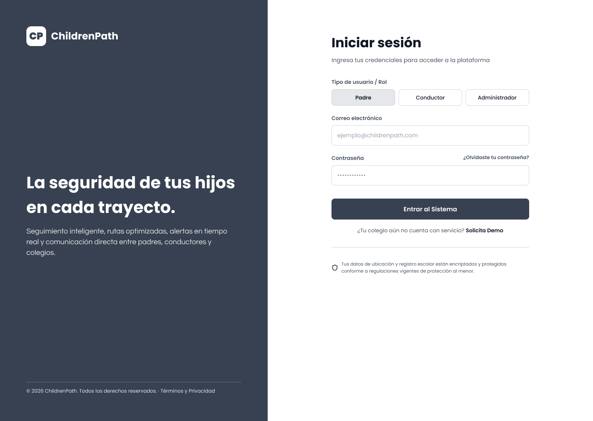  
*Portal de autenticación seguro para padres, conductores y administradores de empresas de movilidad escolar.*

**Wireframe 2: Parent Dashboard** 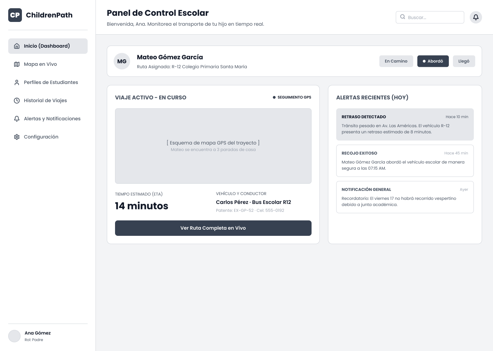  
*Panel de control principal para padres, que muestra los servicios activos y el estado rápido del hijo.*

**Wireframe 3: Live Tracking Map** 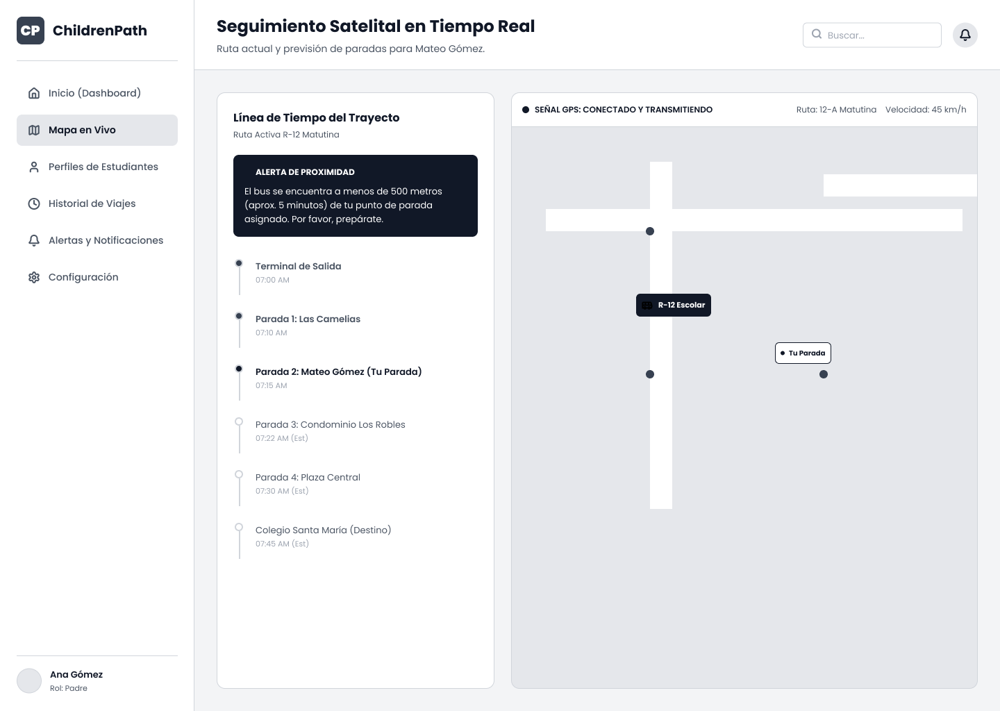  
*Interfaz GPS en tiempo real que muestra la ubicación del bus y el tiempo estimado de llegada (ETA).*

**Wireframe 4: Student Profile Management** 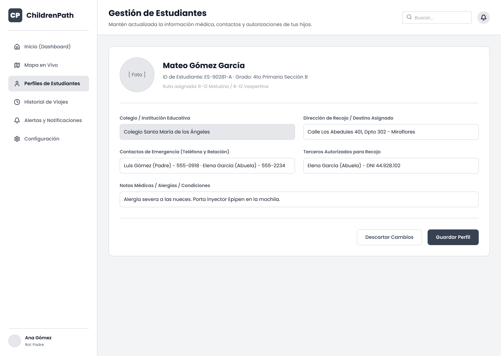  
*Sección dedicada a la gestión de la información del estudiante, contactos de emergencia y notas médicas.*

**Wireframe 5: Trip History** 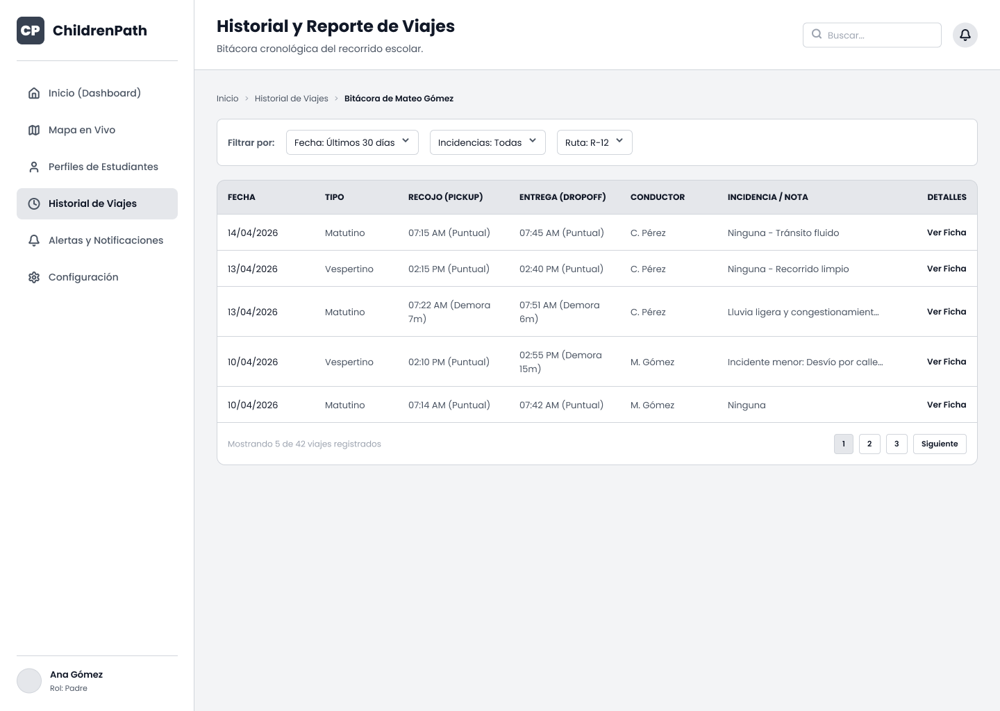  
*Registro detallado de rutas anteriores, incluyendo marcas de tiempo de cada recojo y descenso.*

**Wireframe 6: Driver Main Interface** 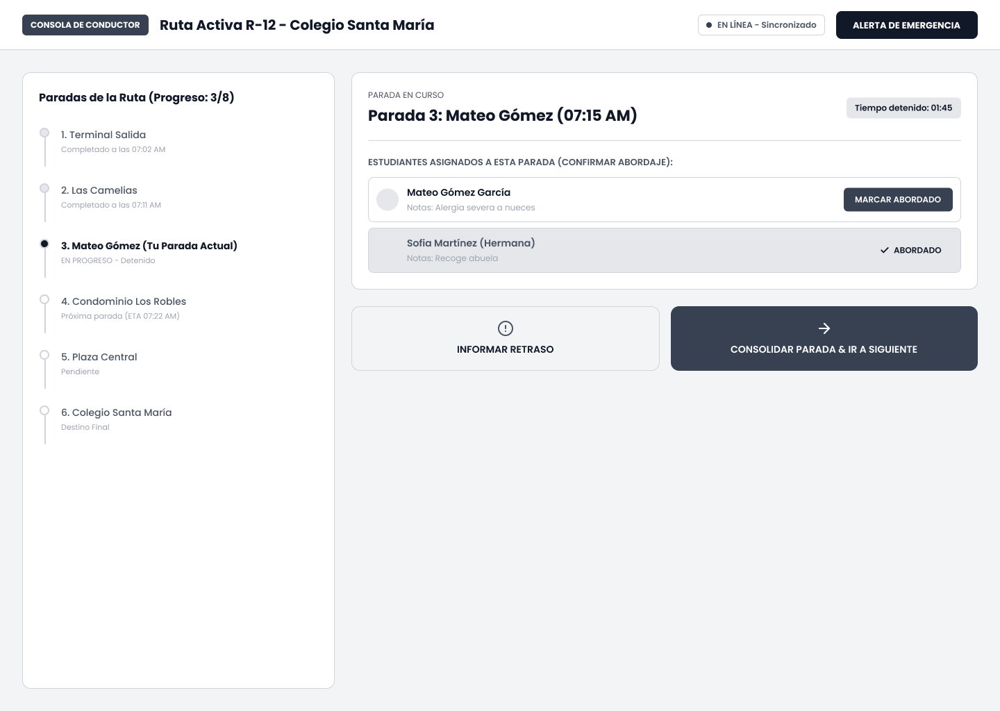  
*Vista operativa para conductores con navegación de ruta activa y gestión de paradas.*

**Wireframe 7: Attendance Checklist** 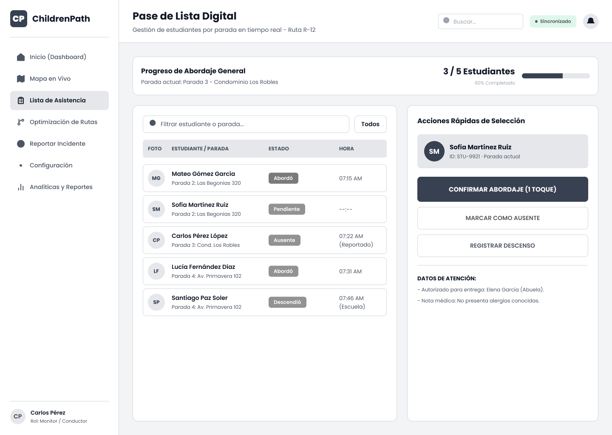  
*Lista digital de estudiantes para la confirmación en tiempo real del abordaje y descenso.*

**Wireframe 8: School Admin Overview** 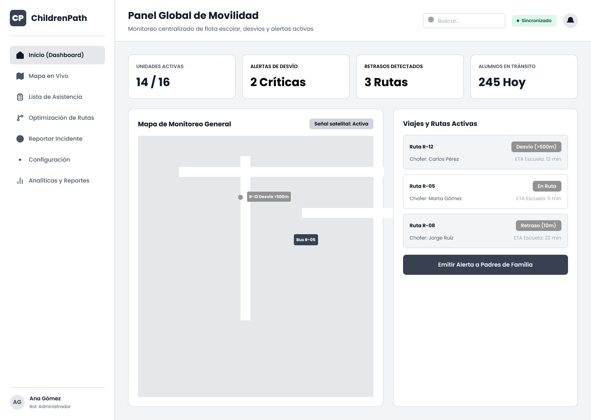  
*Panel de monitoreo global para que las empresas de movilidad escolar rastreen múltiples unidades y su estado de seguridad.*

**Wireframe 9: Route Optimization** 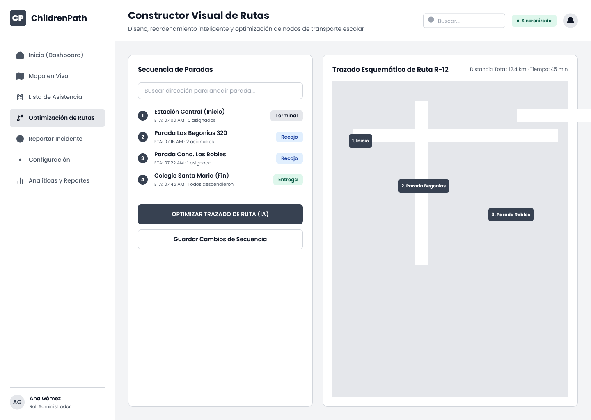  
*Herramienta administrativa para crear nodos y optimizar las rutas de transporte.*

**Wireframe 10: Incident Reporting** 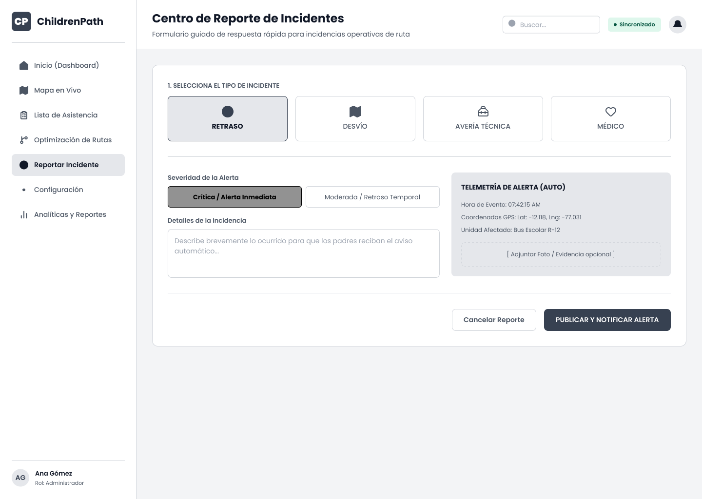  
*Formulario estandarizado para reportar retrasos, fallas mecánicas o alertas de comportamiento.*

**Wireframe 11: Notification Settings** 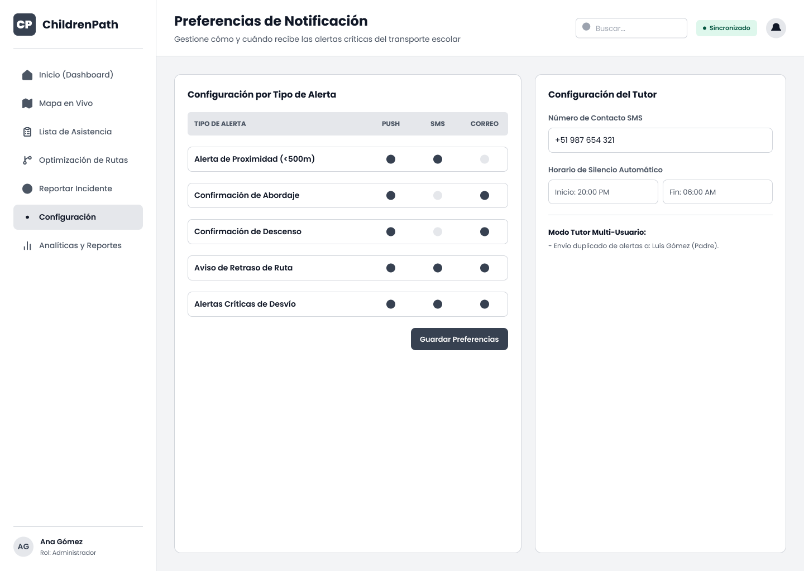  
*Preferencias para notificaciones push, alertas por SMS y comunicación por correo electrónico.*

**Wireframe 12: Analytics & Reports** 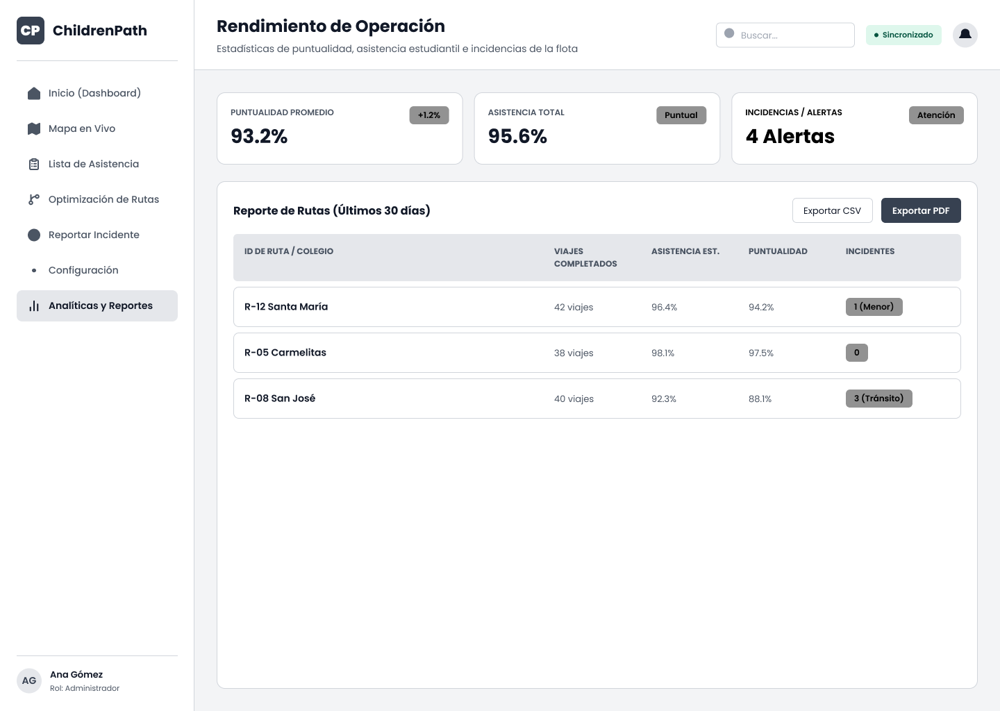  
*Panel de rendimiento de la flota que muestra viajes completados, asistencia promedio y métricas de incidencias.*

### **4.4.2. Web Applications Wireflow Diagrams**

El siguiente diagrama de wireflow ilustra la arquitectura de navegación y la lógica de interacción de la plataforma **Children Path**. Detalla el recorrido desde la fase inicial de autenticación hasta los paneles específicos por rol diseñados para Padres, Conductores y Administradores de Empresas de Movilidad Escolar, asegurando un flujo lógico a través de los 12 wireframes principales.

---

**Wireflow Diagram: System Interaction Logic** 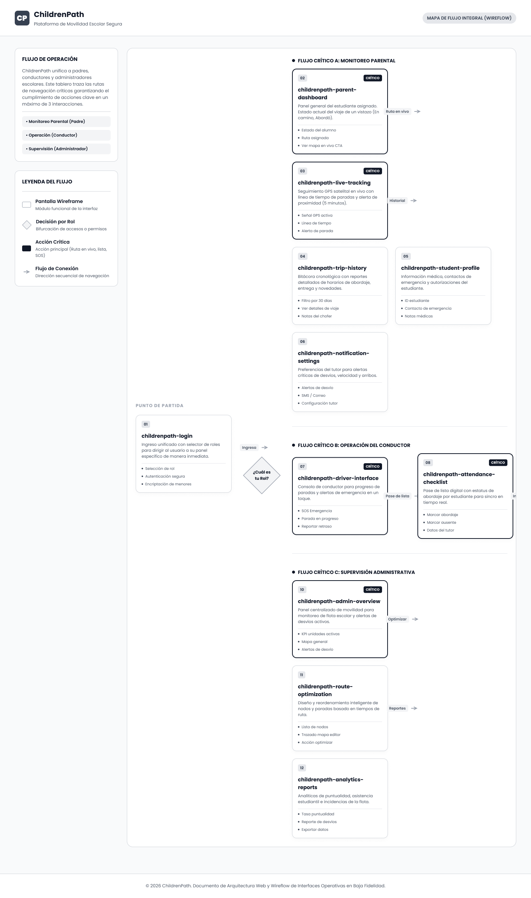

---

### **4.4.3. Web Applications Mock-ups**

Los Mock-ups de **Children Path** representan la fase de alta fidelidad de nuestro diseño de producto. En esta etapa, integramos nuestra identidad visual —incluyendo la paleta de **Azul Children Path** y **Dorado Solar**— con los diseños estructurales previamente definidos. Estos diseños se enfocan en crear una experiencia confiable y moderna, asegurando que cada interfaz no solo sea funcional, sino también emocionalmente reconfortante para los padres y el personal de las empresas de movilidad escolar.

Elementos visuales clave aplicados:
* **Psicología del color:** Uso de azules profundos para evocar confianza y acentos dorados para visibilidad y energía.
* **Accesibilidad:** Texto de alto contraste y tamaños de fuente estándar para garantizar la legibilidad en entornos móviles y web.
* **Micro-interacciones:** Retroalimentación visual en botones y campos de entrada para guiar al usuario de forma intuitiva.

---

**Mock-up 1: User Login**   
*Pantalla de inicio de sesión final de alta fidelidad con branding e interfaz enfocada en la seguridad.*

**Mock-up 2: Parent Dashboard**   
*Vista general codificada por colores para padres con indicadores de estado en tiempo real.*

**Mock-up 3: Live Tracking Map**   
*Interfaz de mapa interactivo con marcadores personalizados del bus y tarjetas dinámicas de tiempo estimado de llegada (ETA).*

**Mock-up 4: Student Profile Management**   
*Vista detallada para gestionar perfiles de estudiantes con campos de ingreso de datos intuitivos.*

**Mock-up 5: Trip History**   
*Registro histórico con abundantes datos y un diseño limpio y organizado para el análisis de rutas pasadas.*

**Mock-up 6: Driver Main Interface**   
*Modo noche/día optimizado para conductores, priorizando la navegación y los objetivos táctiles grandes.*

**Mock-up 7: Attendance Checklist**   
*Lista de verificación de alto contraste para el abordaje de estudiantes en tiempo real y la verificación de seguridad.*

**Mock-up 8: School Admin Overview**   
*Panel administrativo con métricas de flota y monitoreo de viajes activos.*

**Mock-up 9: Route Optimization**   
*Constructor visual de rutas para que los administradores diseñen y asignen puntos de recojo.*

**Mock-up 10: Incident Reporting**   
*Interfaz de alerta urgente diseñada para el reporte rápido en situaciones de alta presión.*

**Mock-up 11: Notification Settings**   
*Panel de personalización de alertas, manteniendo la consistencia visual con la aplicación móvil.*

**Mock-up 12: Analytics & Reports**   
*Gráficos de rendimiento integrales y tablas de datos para la gestión de las empresas de movilidad escolar.*

### **4.4.4. Web Applications User Flow Diagrams**

Los **User Flow Diagrams** de **Children Path** trazan las rutas lógicas precisas que siguen los diferentes usuarios para alcanzar sus objetivos. Estos flujos están diseñados para minimizar la fricción y asegurar que las acciones críticas —como el reporte de emergencias o el seguimiento en tiempo real— sean accesibles en un máximo de tres interacciones.

Hemos priorizado los siguientes tres flujos críticos:

1.  **Flujo de Monitoreo Parental:** Se enfoca en la verificación de seguridad y el acceso inmediato a la ubicación en vivo del estudiante.
2.  **Flujo Operativo del Conductor:** Optimiza el proceso de asistencia y la sincronización de los datos de ruta con el servidor central.
3.  **Flujo de Supervisión del Administrador:** Proporciona una vista de arriba hacia abajo del estado de la flota y la generación de reportes de seguridad automatizados.

---

**User Flow Diagram: Core Platform Interactions**   
*Este diagrama detalla los nodos de decisión y las rutas de acción para Padres, Conductores y Administradores dentro del ecosistema web.*

---

## **Web Applications Prototyping**

## **4.6. Domain-Driven Software Architecture**

  Esta sección presenta la Arquitectura de Software guiada por el Dominio (Domain-Driven Software Architecture) de <strong>Children Path</strong>, estructurada mediante principios de diseño estratégico y táctico para gestionar la complejidad de una plataforma digital de gestión de transporte escolar. El sistema está organizado en Contextos Delimitados (Bounded Contexts) bien definidos, cada uno representando un dominio de negocio independiente como Gestión de Identidad y Acceso, Perfiles de Usuario, Suscripciones y Pagos, Gestión de Flota, Gestión de Conductores, Gestión de Rutas, Gestión de Estudiantes, Gestión de Asignaciones, Rastreo en Tiempo Real, Gestión de Viajes, Control de Asistencia, Alertas y Notificaciones, Gestión de Incidencias, Analítica y Reportes, y Gestión de Empresas. Este enfoque arquitectónico promueve la modularidad, escalabilidad, mantenibilidad y una clara asignación de responsabilidades en toda la solución. Mediante el uso de Diagramas de Contexto, Contenedor, Componente y Clase, la arquitectura alinea los procesos de negocio con la implementación técnica, asegurando que <strong>Children Path</strong> pueda evolucionar de manera eficiente mientras soporta operaciones seguras, coordinación de rutas, visibilidad en tiempo real, control de asistencia y servicios de transporte confiables para operadores independientes, empresas de transporte, empresas de movilidad escolar y familias.

### **4.6.1. Design-Level EventStorming**

-Identity and Access Management Bounded Context

-User profile bounded context

-Subscription and Payments Bounded Context

-Dashboard Bounded Context

-Fleet Management Bounded Context

-Driver Management Bounded Context

-Route Management Bounded Context

-Student Management Bounded Context

-Assignment Management Bounded Context

-Real-Time Tracking Bounded Contex

-Trip Management Bounded Context

-Attendance Tracking Bounded Context

-Alerts and Notifications Bounded Context

- Incident Management Bounded Context

-Analytics and Reports Bounded Context

### **4.6.2. Software Architecture Context Diagram**

- Children Path Context Diagram:

  

### **4.6.3. Software Architecture Container Diagrams**

- Children Path Container Diagram:

  

### **4.6.4. Software Architecture Components Diagrams**

- Children Path Web Application Component Diagram:

  

- Identity & Access Management Component Diagram:

  

- User Profiles Component Diagram:

  

- Subscription & Payments Component Diagram:

  

- Dashboard Component Diagram:

  

- Fleet Management Component Diagram:

  

- Driver Management Component Diagram:

  

- Route Management Component Diagram:

  

- Student Management Component Diagram:

  

- Assignment Management Component Diagram:

  

- Real-Time Tracking Component Diagram:

  

- Trip Management Component Diagram:

  

- Attendance Tracking Component Diagram:

  

- Alerts & Notifications Component Diagram:

  

- Incident Management Component Diagram:

  

- Analytics & Reports Component Diagram:

  

- Company Management Component Diagram:

  

## **4.7. Object-Oriented Design Software**

Esta sección presenta el diseño orientado a objetos de la plataforma <strong>Children Path</strong> a través de Diagramas de Clases UML que modelan la estructura interna del sistema. Los diagramas definen las principales entidades, atributos, métodos, enumeraciones y relaciones necesarias para soportar la lógica de negocio de cada contexto delimitado. Siguiendo los principios del Diseño Guiado por el Dominio (DDD), el modelo de software está organizado en dieciséis dominios funcionales, incluyendo gestión de identidad, perfiles de usuario, suscripciones, dashboard, flota, conductores, rutas, estudiantes, asignaciones, rastreo en tiempo real, viajes, asistencia, alertas, incidencias, analítica y gestión de empresas. Estos diagramas proporcionan un plano claro para la implementación del software, promueven la mantenibilidad y aseguran la consistencia entre los requisitos de negocio y la arquitectura técnica.

### **4.7.1. Class Diagrams**

- Diagrama de Clases de Gestión de Identidad y Acceso:

  

- Diagrama de Clases de Perfiles de Usuario:

  

- Diagrama de Clases de Suscripciones y Pagos:

  

- Diagrama de Clases del Dashboard:

  

- Diagrama de Clases de Gestión de Flota:

  

- Diagrama de Clases de Gestión de Conductores:

  

- Diagrama de Clases de Gestión de Rutas:

  

- Diagrama de Clases de Gestión de Estudiantes:

  

- Diagrama de Clases de Gestión de Asignaciones:

  

- Diagrama de Clases de Rastreo en Tiempo Real:

  

- Diagrama de Clases de Gestión de Viajes:

  

- Diagrama de Clases de Control de Asistencia:

  

- Diagrama de Clases de Alertas y Notificaciones:

  

- Diagrama de Clases de Gestión de Incidencias:

  

- Diagrama de Clases de Analítica y Reportes:

  

- Diagrama de Clases de Gestión de Empresas:

  

## **4.8. Database Design**

Esta sección define el diseño de la base de datos de la plataforma <strong>Children Path</strong>, enfocándose en la organización lógica, la estrategia de persistencia y la estructura de datos requerida para soportar las funcionalidades del sistema. Basado en los contextos delimitados y modelos orientados a objetos previamente definidos, el diseño de la base de datos asegura la integridad de los datos, la escalabilidad, la trazabilidad y el acceso eficiente a la información operativa. Incluye la identificación de entidades principales, relaciones, restricciones y consideraciones de almacenamiento para módulos como usuarios, suscripciones, flotas, vehículos, conductores, rutas, estudiantes, viajes, asistencia, alertas, incidencias, reportes y registros de empresa. Los diagramas detallados de la base de datos y la implementación relacional se presentan en la siguiente subsección.

### **4.8.1. Database Diagrams**

- Diagrama de Base de Datos de Children Path:

  

- Diagrama de Base de Datos de Gestión de Identidad y Acceso:

  

- Diagrama de Base de Datos de Perfiles de Usuario:

  

- Diagrama de Base de Datos de Suscripciones y Pagos:

  

- Diagrama de Base de Datos del Dashboard:

  

- Diagrama de Base de Datos de Gestión de Flota:

  

- Diagrama de Base de Datos de Gestión de Conductores:

  

- Diagrama de Base de Datos de Gestión de Rutas:

  

- Diagrama de Base de Datos de Gestión de Estudiantes:

  

- Diagrama de Base de Datos de Gestión de Asignaciones:

  

- Diagrama de Base de Datos de Rastreo en Tiempo Real:

  

- Diagrama de Base de Datos de Gestión de Viajes:

  

- Diagrama de Base de Datos de Control de Asistencia:

  

- Diagrama de Base de Datos de Alertas y Notificaciones:

  

- Diagrama de Base de Datos de Gestión de Incidencias:

  

- Diagrama de Base de Datos de Analítica y Reportes:

  

- Diagrama de Base de Datos de Gestión de Empresas:

  

